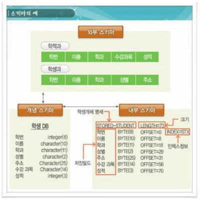

# Database - 1

# Database - 1

### [Reference]

- [http://www.tcpschool.com/mysql/DB](http://www.tcpschool.com/mysql/DB)
- [https://coding-factory.tistory.com/](https://coding-factory.tistory.com/)
- [https://ykcb.tistory.com/entry/데이터베이스-스키마의-개념-특징](https://ykcb.tistory.com/entry/%EB%8D%B0%EC%9D%B4%ED%84%B0%EB%B2%A0%EC%9D%B4%EC%8A%A4-%EC%8A%A4%ED%82%A4%EB%A7%88%EC%9D%98-%EA%B0%9C%EB%85%90-%ED%8A%B9%EC%A7%95)
- [https://doorbw.tistory.com/229](https://doorbw.tistory.com/229)
- [https://limkydev.tistory.com/108](https://limkydev.tistory.com/108)
- [https://jojoldu.tistory.com/520](https://jojoldu.tistory.com/520)


## 💡데이터베이스란 무엇인가?

- 데이터베이스(DB: Database)는 통합하여 관리되는 데이터의 집합체를 의미한다.
- 이는 중복된 데이터를 없애고, 자료를 구조화하여, 효율적인 처리를 할 수 있도록 관리된다.
- 이러한 데이터베이스는 응용 프로그램과는 다른 별도의 미들웨어에 의해 관리된다.
- 미들웨어는 양 쪽을 연결하여 데이터를 주고 받을 수 있도록 중간에서 매개 역할을 하는 소프트웨어, 네트워크를 통해서 연결된 여러 개의 컴퓨터에 있는 많은 프로세스들에게 어떤 서비스를 사용할 수 있도록 연결해 주는 소프트웨어를 말한다.
- 데이터베이스를 관리하는 이러한 미들웨어를 **데이터베이스 관리 시스템(DBMS: Database Management System)** 이라고 부른다.

```sql
데이터베이스는 통합하여 관리되는 데이터의 집합체를 말합니다.
중복되는 데이터를 없애고 자료를 구조화하여 효율적인 처리를 할 수 있도록 관리합니다.
```

---

## 💡Database의 특징을 설명하시오.

- 사용자의 질의에 대하여 즉각적인 처리와 응답이 이루어진다.
- 생성, 수정, 삭제를 통하여 항상 최신의 데이터를 유지한다.
- 사용자들이 원하는 데이터를 동시에 공유할 수 있다.
- 사용자가 원하는 데이터를 주소가 아닌 내용에 따라 참조할 수 있다.
- 응용 프로그램과 데이터베이스는 독립되어 있으므로, 데이터의 논리적 구조와 응용 프로그램은 별개로 동작한다.

---

## 💡Database 설계 시, 고려할 점을 설명하시오.

1. **무결성 :** 삽입, 삭제, 갱신 등의 연산 후에도 데이터베이스에 저장된 데이터가 정해진 제약조건을 항상 만족해야한다.
2. **일관성 :** 데이터베이스에 저장된 데이터들 사이나, 특정 질의에 대한 응답이 처음부터 끝까지 변함없이 일정해야한다.
3. **회복 :** 시스템에 장애가 발생했을 때장애 발생 직전의 상태로 복구할 수 있어야 한다.
4. **보안 :** 불법적인 데이터의 노출 또는 변경이나 손실로부터 보호할 수 있어야 한다.
5. **효율성 :** 응답시간의 단축, 시스템의 생산성, 저장 공간의 최적화 등이 가능해야한다.
6. **데이베이스 확장 :** 데이터베이스 운영에 영향을 주지 않으면서 지속적으로 데이터를 추가할 수 있어야한다.

```sql
Database 설계시에는 `무결성`, `일관성`, `회복`, `보안`, 효율성`, `확장성`을 고려해야합니다.
~~~
```

### 보편적인 DB 설계 단계

**1. 요구 분석**

요구조건 분석은 데이터베이스를 사용할 사람들로부터 필요한 용도를 파악하는 것이다.

데이터베이스 사용자에 따른 수행업무와 필요한 데이터의 종류 용도, 처리 형태, 흐름, 제약 조건 등을 수집한다.

수집된 정보를 바탕으로 요구 조건 명세를 작성한다.

**2. 개념적 설계(설계 단계)**

개념적 설계란 정보의 구조를 얻기 위하여 현실 세계의 무한성과 계속성을 이해하고, 다른 사람과 통신하기 위하여 현실 세계에 대한 인식을 추상적 개념으로 표현하는 과정이다.

**3. 논리적 설계(설계 단계)**

논리적 설계 단게에서는 현실 세계에서 발생하는 자료를 컴퓨터가 이해하고 처리할 수 있는 물리적 저장장치에 저장할 수 있도록 변환하기 위해 특정 DBMS가 지원하는 논리적 자료 구조로 변환시키는 과정이다.

**4. 물리적 설계(설계 단계)**

논리적 설계단계에서 논리적 구조로 표현된 데이터를 디스크 등의 물리적 저장장치에 저장할 수 있는 물리적 구조의 데이터로 변환하는 과정이다.

**5. 데이터베이스 구현**

구현단계는 논리적 설계 단계와 물리적 설계 단계에서 도출된 데이터베이스 스키마를 파일로 생성하는 단계이다.

---

## 💡Schema가 무엇인가요?

### **스키마란?**

**1.** 스키마는 데이터베이스의 구조와 제약 조건에 관한 전반적인 명세를 기술한 메타데이터의 집합이다.

**2.** 스키마는 데이터베이스를 구성하는 데이터 개체(Entity), 속성(Attribute), 관계(Relationship) 및 데이터 조작 시 데이터 값들이 갖는 제약 조건 등에 관해 전반적으로 정의한다.

**3.** 스키마는 사용자의 관점에 따라 외부 스키마, 개념 스키마, 내부 스키마로 나눠진다.



```sql
스키마는 데이터베이스의 구조와 제약조건에 대한 전반적인 명세를 기술한 것을 말합니다.
관점에 따라서 외부스키마, 개념스키마, 내부스키마 3계층으로 분류할 수 있습니다.
```

### **스키마의 특징**

**1.** 스키마는 데이터 사전(Data Dictionary)에 저장되며, 다른 이름으로 메타데이터라고도 한다.

**2.** 스키마는 현실 세계의 특정한 한 부분의 표현으로서 특정 데이터 모델을 이용해서 만들어진다.

**3.** 스키마는 시간에 따라 불변인 특성을 갖는다.

**4.** 즉, 스키마는 데이터의 구조적 특성을 의미하며, 인스턴스에 의해 규정된다.

### **스키마의 3계층**

데이터베이스 관리 시스템은 외부적 스키마에 따라 명시된 사용자의 요구를 개념적 스키마에 적합한 형태로 변경하고 이를 다시 내부적 스키마에 적합한 형태로 변환한다.


### 1. **외부 스키마(External Schema) = 사용자 뷰(View)**

1. 외부스키마는 사용자나 응용프로그래머가 각 개인의 입장에서 필요로 하는 데이터베이스의 논리적 구조를 정의한 것이다.
2. 외부스키마는 전체 데이터베이스의 한 논리적인 부분으로 볼 수 있으므로 서브 스키마(Sub Schema)라고도 한다.
3. 하나의 데이터베이스 시스템에는 여러개의 외부 스키마가 존재할 수 있으며 하나의 외부 스키마를 여러개의 응용 프로그램이나 사용자가 공용할 수도 있다.
4. 같은 데이터베이스에 대해서도 서로 다른 관점을 정의할 수 있도록 허용한다.
5. 일반 사용자는 질의어(SQL)을 이용하여 DB를 쉽게 사용할 수 있다.
6. 응용 프로그래머는 C, JAVA등의 언어를 사용하여 DB에 접근한다.


### 2. **개념 스키마(Conceptual Schema) = 전체적인 뷰(View)**

1.  개념 스키마는 데이터베이스의 전체적인 논리적 구조로서, 모든 응용 프로그램이나 사용자들이 필요로 하는 데이터를 종합한 조직 전체의 데이터베이스로 하나만 존재한다.
2.  개념스키마는 개체간의 관계와 제약 조건을 나타내고 데이터베이스의 접근 권한, 보안 및 무결성 규칙에 관한 명세를 정의한다.
3.  데이터베이스 파일에 저장되는 데이터의 형태를 나타내는 것으로, 단순히 스키마(Schema)라고 하면 개념 스키마를 의미한다.
4.  기관이나 조직체의 관점에서 데이터베이스를 정의한것이다.
5. 데이터베이스 관리자(DBA)에 의해서 구성된다.

### 3. **내부 스키마(Internal Schema) = 저장 스키마(Storage Schema)**

1.  내부 스키마는 물리적 저장장치의 입장에서 본 데이터베이스 구조로, 물리적인 저장장치와 밀접한 계층이다.
2.  내부스키마는 실제로 데이터베이스에 저장될 레코드의 물리적인 구조를 정의하고, 저장 데이터 항목의 표현방법, 내부 레코드의 물리적 순서 등을 나타낸다.
3.  시스템 프로그래머나 시스템 설계자가 보는 관점의 스키마이다

---

## 💡DBMS는 무엇인가요?

- DBMS란 사용자와 데이터베이스 사이에서 사용자의 요구에 따라 정보를 생성해주고 데이터베이스를 관리할 수 있게 해주는 소프트웨어입니다.
- DBMS는 기존의 파일 시스템이 갖는 데이터의 종속성과 중복성의 문제를 해결하기 위해 제안된 시스템으로 모든 응용 프로그램들이 데이터베이스를 공용할 수 있도록 관리해줍니다.
- DBMS는 데이터베이스의 구성, 접근 방법, 유지관리에 대한 모든 책임을 집니다.

```bash
DBMS는 기존의 파일 시스템이 갖는 데이터의 종속성과 중복성의 문제를 해결하기 위해 제안된 시스템으로,
사용자와 데이터베이스 사이에서 사용자의 요구에 따라 정보를 생성해주고 데이터베이스를 관리할 수 있게 해주는 소프트웨어입니다.
```

### **데이터베이스 데이터구성**

데이터베이스를 이용하는 방식에서는 각 업무 처리에 필요한 자료들의 중복을 최소화 하여 한 곳에 모아서 구성한다.


### **DBMS의 발전 배경**

1. 종래의 파일 처리 방식에서의 데이터 구성

    종래의 파일 처리 방식에서는 처리 업무 하나하나마다 데이터 파일을 독립적으로 구성함으로써 같은 내용의 데이터가 서로 다른 업무의 파일에서 중복 저장되어 관리되는 데이터 중복성과, 응용 프로그램과 데이터 간의 상호 의존 관계에 따른 데이터 종속성을 초래하는 단점이 있다.

2. 종속성으로 인한 문제점

    응용 프로그램과 데이터 파일이 상호 의존적인 관계에서는 데이터 파일이 보조기억장치에 저장되는 방법이나 저장된 데이터의 접근 방법을 변경할 때 응용프로그램도 같이 변경하여야 한다.

3. 중복성으로 인한 문제점
    1. **일관성 :** 중복된 데이터 간에 내용이 일치하지 않는 상황이 발생하여 일관성이 없어진다.
    2. **보안성 :** 중복되어 있는 모든 데이터에 동등한 보안수준을 유지하기가 어렵다.
    3. **경제성 :** 저장공간의 낭비와 동일한 데이터의 반복 작업으로 비용이 증가한다.
    4. **무결성 :** 제어의 분산으로 데이터의 정확성을 유지할 수 없다.

---

## 💡DBMS의 속성에는 무엇이 있나요?

기존의 시스템인 파일 처리 시스템은 데이터의 종속, 중복, 무결성 훼손, 동시접근의 문제를 가지고 있었다. 이러한 단점을 극복하고 나온 것이 바로 데이터베이스 관리 시스템이고, 특징은 아래와 같다.

```markdown
DBMS는 실시간 접근성, 데이터 독립성, 자기 기술성, 다중 뷰 제공, 트랜잭션 처리 등의 특징을 가집니다.
```

1.  **실시간 접근 가능**

    데이터베이스는 지속적이고 비정형적인 사용자의 요구 사항을 처리해야하기 때문에 실시간으로 접근이 가능해야하며, 동적인 상태에서 데이터를 처리(삽입, 삭제, 갱신 등)해야 한다.

2.  **자기기술성, 내용에 의한 참조**

    DBMS의 데이터는 데이터 값과 데이터의 부연설명(메타데이터)를 같이 가지고 있다. 데이터들의 관계나 속성, 즉 ‘제약조건’을 정의하는 메타데이터가 있기 때문에 데이터의 구조를 보다 쉽게 변경할 수 있다. 예를 들어 기존에는 ‘주소나 특정 위치’를 찾아 데이터를 변경했다면, 이제는 ‘데이터의 내용’으로 검색할 수 있기 때문에 데이터의 구조를 쉽게 변경할 수 있다.

3.  **응용프로그램과 데이터의 독립**

    DBMS는 3단계 구조로 이뤄져있기 때문에 응용프로그램과 데이터가 논리적으로도, 물리적으로도 분리되어 있다. (외부–개념 사상의 단계가 논리적 데이터 독립성을 보여주고, 개념–내부 사상의 단계가 물리적 데이터 독립성을 보여준다.)

    `데이터가 독립적`이라는 것은 여러가지 장점이 있는데,

    1. 하위 단계의 데이터 구조가 변경되어도 상위 단계에는 영향을 미치지 않는다.
    2. 데이터베이스 구조가 바뀌어도, 프로그램에 영향을 미치지 않는다.
    3. 데이터의 표형 방법이나 저장 위치가 바뀌어도, 프로그램에 영향을 미치지 않는다.즉, 유지보수가 쉽고, 데이터의 중복을 최소화하고, 사용자의 요구사항에 보다 빠르게 대응할 수 있다!
4.  **다중 뷰 제공**

    DBMS의 3단계 구조에서 기인한 장점으로, 뷰(외부 스키마)마다 데이터를 다르게 선택하여 보여줄 수 있기 때문에 사용자 입장에서는 복잡한 데이터 구조를 생각하지 않고도 원하는 데이터만 접근하여 업무를 처리할 수 있다.

5. **트랜잭션 처리(격리성)**

    파일 처리 시스템에서 다수의 사용자가 동시 접근하면 데이터 관리의 일관성이 떨어진다. 예를 들어 동시간 대에 사용자 A와 사용자 B가 데이터 1에 접근해서 작업을 한다고 하자. 이때 동시 작업한 것이 꼬이지 않고 처리되어 서로 공유가 되어야하는데, 파일 처리 시스템을 이러한 기능을 적절히 제공하지 못한다. 반면에 데이터베이스는 ‘트랜잭션’ 단위로 처리하여 다수의 데이터 조작 요청을 일관되게 처리할 수 있다.

### [정리] **DBMS사용시 효과**

1. 데이터의 논리적 물리적 독립성이 보장된다.
2. 데이터의 중복을 피할 수 있어 기억공간이 절약된다.
3. 저장된 자료를 공동으로 이용할 수 있다.
4. 데이터의 일관성을 유지할 수 있다.
5. 데이터의 무결성을 유지할 수 있다.
6. 보안을 유지할 수 있다.
7. 데이터를 표준화 할 수 있다.
8. 데이터를 통합하여 관리할 수 있다.
9. 항상 최신의 데이터를 유지한다.
10. 데이터의 실시간 처리가 가능하다.

---

## 💡데이터 모델링이 무엇인가요?

- 1. 모델링
<details>
<summary>1. 모델링</summary>
<div markdown="1">

### 1. 모델링이란?

- **모델링이라는 것은 우리 주변에 있는 사람, 사물, 개념 등 다양한 현상을 발생시키는 것들을 일정한 표기법에 의해 나타내는 것을 이야기 한다.**
- 모델링에 대한 사전적 정의로는 아래와 같이 다양하게 존재한다.
    - 가설적 또는 일정 양식에 맞춘 표현
    - 어떤 것에 대한 예비표현으로 그로부터 최종대상이 구축되도록 하는 계획으로서 기여하는 것
    - 복잡한 '현실세계'를 단순화시켜 표현하는 것

### 2. **모델링의 특징**

모델링의 특징으로는 다음과 같이 대표적으로 3가지, **추상화, 단순화, 명확화** 3가지로 요약할 수 있다.

1. **추상화(모형화, 가설적)**

    추상화는 현실세계를 일정한 형식에 맞추어 표현을 한다는 의미이다. 다양한 현상을 일정한 양식인 표기법에 의해 표현한다는 것이다.

2. **단순화**

    단순화는 복잡한 현실세계를 약속된 규약에 의해 제한된 표기법이나 언어로 표현하여 현실세계를 보다 쉽게 이해할 수 있도록 하는 개념을 의미한다.

3. **명확화**

    명확화란 누구나 이해하기 쉽도록 대상에 대한 애매모호함을 제거하고 보다 정확하게 현상을 기술하는 것을 의미한다.

### 3. **모델링의 3가지 관점**

시스템의 대상이 되는 업무를 분석하여 정보시스템으로 구성하는 과정에서 업무의 내용과 정보시스템의 모습을 적절한 표기법으로 표현하는 것을 모델링이라고 한다면, 이러한 모델링은 크게 3가지 관점, 데이터관점, 프로세스관점, 데이터와 프로세스의 상관관점으로 구분할 수 있다.

1. **데이터 관점(What)**

    업무가 어떤 데이터와 관련이 있는지 또는 데이터 간의 관계는 무엇인지에 대해서 모델링하는 방법

2. **프로세스 관점(How)**

    업무가 실제하고 있는 일은 무엇인지 또는 무엇을 해야 하는지를 모델링하는 방법

3. **데이터와 프로세스의 상관관점**

    업무가 처리하는 일의 방법에 따라 데이터는 어떻게 영향을 받고 있는지 모델링하는 방법

</div>
</details>


    

### 2. 데이터 모델링

1.  **데이터 모델링이란?**

    데이터 모델링의 기반이 되는 데이터 모델은 데이터베이스의 골격을 이해하고 그 이해를 바탕으로 SQL문장을 기능과 성능적인 측면에서 효율적으로 작성하기 위해 꼭 알아야 하는 핵심요소이다. 이러한 데이터 모델을 만드는 데이터 모델링은 다음과 같이 정의 될 수 있다.

    - **정보시스템을 구축하기 위한 데이터관점의 업무 분석 기법**
    - **현실세계의 데이터(What)에 대해 약속된 표기법으로 표현하는 과정**
    - **데이터베이스를 구축하기 위한 분석/설계 과정**

```markdown
주어진 개념으로부터 논리적인 데이터 모델을 구성하는 작업을 말하며, 
일반적으로 이를 물리적인 데이터베이스 모델로 환원하여 고객의 요구에 따라 특정 정보 시스템의 데이터베이스에 반영하는 작업을 포함한다.
```

1. **데이터 모델이 제공하는 기능**
    - 시스템을 현재 또는 원하는 모습으로 가시화하도록 도와준다.
    - 시스템의 구조와 행동을 명세화 할 수 있게 한다.
    - 시스템을 구축하는 구조화된 틀을 제공한다.
    - 시스템을 구축하는 과정에서 결정한 것을 문서화한다.
    - 다양한 영역에 집중하기 위해 다른 영역의 세부 사항은 숨기는 다양한 관점을 제공한다.
    - 특정 목표에 따라 구체화된 상세 수준의 표현방법을 제공한다.

2. **데이터 모델링의 중요성과 유의점**
    - **데이터 모델링의 중요성**

        데이터 모델링이 중요한 이유는 파급효과(Leverage), 복잡한 정보 요구사항의 간결한 표현(Conciseness), 데이터 품질(Data Quality)로 정리할 수 있다.

        - **파급효과(Leverage)**

            데이터 모델링이 초기에 제대로 이루어지지 않는다면, 시스템이 구현되고 테스트 하는 과정 중 그 문제점이 나타날 수 있다. 일반적으로 단위테스트, 통합테스트 등 다양한 단계의 테스트를 진행하는데 데이터 모델링의 문제가 발생해 데이터 모델을 변경해야 하는 상황이 온다면 데이터 모델, 구조 변경에 따른 표준 영향 분석, 응용 변경 영향 분석 등 다양한 분석이 필요해진다. 또한 그 이후의 실질적 구조 변경 작업이 진행되어야 한다.

        - **복잡한 정보 요구사항의 간결한 표현(Conciseness)**

            데이터 모델은 구축할 시스템의 정보 요구사항과 한계를 가장 명확하고 간결하게 표현할 수 있는 도구이다. 정보 요구사항이 정확하고 간결하게 표현되어야 해당 데이터 모델과 관련된 시스템을 구축하는 많은 사람들이 설계자의 생각대로 정보 요구사항을 이해할 수 있을 것이고, 이를 운용할 수 있는 서비스/어플리케이션을 개발하며 데이터 정합성을 유지할 수 있다.

        - **데이터 품질(Data Quality)**

            데이터베이스에 담겨 있는 데이터는 기업/단체의 중요한 자산이다. 특정 데이터에 대해서는 그 기간이 늘어날 수록 활용가치가 더 높아지기도 한다. 헌데, 그러한 데이터의 정확성이 떨어지는 등 데이터 품질이 낮아진다면 어떨까? 이는 해당 데이터로 얻을 수 있었던 비즈니스 기회를 상실할 수도 있는 문제가 된다.

            데이터 품질에 대한 고찰은 데이터가 쌓이는 초기에는 쉽게 인지를 못하는 경우가 대부분이기에 초기 부터 오랜 기간 숙성된 데이터를 전략적으로 활용하기 위해 데이터 품질에 대한 중요성을 기억해야 한다.

    - **데이터 모델링할 때 유의점**

        또한 위와 같은 중요성을 지키기에 앞서, 데이터 모델링을 할 때 유의해야 할 점은 다음과 같다.

        - **중복(Duplication)**

            데이터 모델은 같은 데이터를 사용하는 사람, 시간, 그리고 장소를 파악하는데 도움을 준다. 이러한 자식 응용은 데이터베이스가 여러 장소에 같은 정보를 저장하는 잘못을 하지 않도록 한다.

        - **비유연성(Inflexibility)**

            데이터 모델을 어떻게 설계했느냐에 따라 사소한 업무변화에도 데이터 모델이 수시로 변경됨으로써 유지보수의 어려움을 가중시킬 수 있다. **데이터의 정의를 데이터의 사용 프로세스와 분리**함으로써 데이터 모델링은 데이터 혹은 프로세스의 작은 변화가 애플리케이션과 데이터베이스에 중대한 변화를 일으킬 수 있는 가능성을 줄인다.

        - **비일관성(Inconsistency)**

            데이터의 중복이 없더라도 비일관성은 발생할 수 있다. 예를 들어 신용 상태에 대한 갱신 없이 고객의 납부 이력 정보를 갱신하는 것이다. 개발자가 다른 데이터와 모순된다는 고려 없이 일련의 데이터를 수정할 수 있기 때문이다. 데이터 모델링을 할 때 **데이터와 데이터간 상호 연관 관계에 대한 명확한 정의**는 이러한 위험을 사전에 예방할 수 있도록 해준다.

### 3. **데이터 모델링의 3가지 요소**

데이터 모델링을 구성하는 중요한 개념 3가지가 있는데 이것은 데이터 모델에 대한 이해의 근간이 되므로 반드시 기억할 필요가 있다.

1.  업무가 관여하는 어떤 것(Things)
2.  어떤 것이 가지는 성격(Attributes)
3.  업무가 관여하는 어떤 것 간의 관계(Relationship)

위 3가지는 데이터 모델링을 완성해가는 개념이며 결국 엔터티, 속성, 관계를 나타낸다.

---

## 💡메타데이터란 무엇인가?

- 데이터에 관한 구조화된 데이터로, 다른 데이터를 설명해 주는 데이터이다.
- 대량의 정보 가운데에서 찾고 있는 정보를 효율적으로 찾아내서 이용하기 위해 일정한 규칙에 따라 콘텐츠에 대하여 부여되는 데이터이다.
- 어떤 데이터 즉 구조화된 정보를 분석, 분류하고 부가적 정보를 추가하기 위해 그 데이터 뒤에 함께 따라가는 정보를 말한다.
- 개념 Schema

```markdown
메타데이터란 데이터에 관한 구조화된 데이터로, 다른 데이터를 설명해 주는 데이터입니다.
즉 구조화된 정보를 분석, 분류하고 부가적 정보를 추가하기 위해 그 데이터 뒤에 함께 따라가는 정보를 말한다.
```

---

## 💡키의 종류에는 어떤게 있나요?

### **데이터 베이스 키(Key)의 개념**

키(Key)는 데이터베이스에서 조건에 만족하는 튜플을 찾거나 순서대로 정렬할 때 다른 튜플들과 구별할 수 있는 유일한 기준이 되는 Attribute(속성)이다.

```markdown
데이터베이스에는 후보키, 기본키, 대체키, 슈퍼키, 외래키가 있습니다.
후보키는 릴레이션을 구성하는 속성들 중에서 튜플을 **유일하게 식별할 수 있는 속성들의 부분집합을 의미하며,**
이 중 선택한 하나를 기본키, 나머지를 대체키라고 합니다.
외래키는 다른 테이블이 기본키와 대응되며 이 기본키를 참조하여 구분하는 역할을 하고,
슈퍼키는 속성들의 집합으로 구성된 키로 유일성은 만족하지만 최소성은 만족하지 못합니다.
```

### 키의 종류


1. **후보키 (Candidate Key)**
    - 릴레이션을 구성하는 속성들 중에서 튜플을 **유일하게 식별할 수 있는 속성들의 부분집합을 의미**한다.
    - **모든 릴레이션은 반드시 하나 이상의 후보키를 가져야한다.**
    - 릴레이션에 있는 모든 튜플에 대해서 **유일성과 최소성을 만족**시켜야한다.
    - ex) <학생> 릴레이션에서 '학번'이나 '주민번호'는 다른 레코드를 유일하게 구별할 수 있는 기본키로 사용할 수 있으므로 후보키가 될 수 있다.
    - 즉, 기본키가 될 수 있는 키들을 `후보키`라고 한다.
2. **기본키 (Primary Key)**
    - 후보키 중에서 선택한 주키(Main Key)
    - 한 릴레이션에서 **특정 튜플을 유일하게 구별할 수 있는 속성**
    - **Null 값을 가질 수 없다**. (개체 무결성의 첫번째 조건)
    - 기본키로 정의된 속성에는 **동일한 값이 중복되어 저장될 수 없다.**(개체 무결성의 두번째 조건)
    - ex) <학생> 릴레이션에는 '학번'이나 '주민번호'가 기본키가 될 수 있고, <수강> 릴레이션에는 '학번'+'과목명'으로 조합해야 기본키가 만들어 질 수 있다. <수강> 릴레이션에서는 '학번' 속성과 '과목명' 속성은 개별적으로 기본키로 사용할 수 없다.
    - ex) <학생> 릴레이션에서 '학번'을 기본키로 정의되면 이미 입력된 '1001'은 다른 튜플의 '학번' 속성 값으로 입력할 수 없다.
3. **대체키 (Alternate Key)**
    - **후보키가 둘 이상일 때 기본키를 제외한 나머지 후보키들을 말한다.**
    - 보조키라고도 부른다.

    ex) <학생> 릴레이션에서 '학번'을 기본키로 정의하면 '주민번호'는 대체키가 된다.

4. **슈퍼키 (Super Key)**
    - **슈퍼키는 한 릴레이션 내에 있는 속성들의 집합으로 구성된 키**로서 릴레이션을 구성하는 모든 튜플 중 슈퍼키로 구성된 속성의 집합과 동일한 값은 나타내지 않는다.
    - 릴레이션을 구성하는 모든 튜플에 대해 **유일성은 만족하지만, 최소성은 만족시키지 못합니다.**
    - ex) <학생> 릴레이션에서는 '학번', '주민번호', '학번'+'주민번호', '학번'+'주민번호'+'성명' 등으로 슈퍼키를 구성할 수 있다. 또한 여기서 최소성을 만족시키지 못한다는 말은 '학번'+'주민번호'+'성명' 가 슈퍼기인 경우 3개의 속성 조합을 통해 다른 튜플과 구별이 가능하지만, '성명' 단독적으로 슈퍼키를 사용했을 때는 구별이 가능하지 않기 때문에 최소성을 만족시키지 못한다. 즉 뭉쳤을 경우 유일성이 생기고, 흩어지면 몇몇 속성들은 독단적으로 유일성있는 키로 사용할 수 없다. 이것을 최소성을 만족하지 못한다고 한다.
5.  **외래키 (Foreign Key)**
    - 관계(Relation)를 맺고 있는 릴레이션 R1, R2에서 릴레이션 R1이 참조하고 있는 릴레이션 R2의 기본키와 같은 R1 릴레이션의 속성을 외래키라고 한다.
    - 외래키는 **참조되는 릴레이션의 기본키와 대응되어, 릴레이션 간에 참조 관계를 표현하는데 중요한 도구**로 사용된다.
    - **외래키로 지정되면 참조 테이블의 기본키에 NULL 값은 입력할 수 없다.** (참조 무결성 조건)

    ex) <수강> 릴레이션이 <학생> 릴레이션을 참조하고 있다면, <학생> 릴레이션의 '학번'은 기본키이고, <수강>릴레이션의 '학번'은 외래키dlek.

    즉 각 릴레이션의 입장에서 속성은 기본키가 되기도하고, 외래키가 되기도 한다.

    ex) <수강> 릴레이션의 '학번'에는 <학생> 릴레이션의 '학번'에 없는 값은 입력할 수 없다.

6. **NULL 값**
- **>데이터베이스에서 아직 알려지지 않았거나, 모르는 값으로서 "해당 없음" 등의 이유로 정보 부재를 나타내기 위해 사용하는, 이론적으로 아무것도 없는 특수한 데이터를 뜻한다다.**
- **> 철학적으로 "아무것도 없음", "의미 없음"도 의미 있는 data이다.**

---

## 💡무결성 제약조건에 대해 아는대로 서술하시오.

### **무결성(Integrity) 제약조건**


**1. 개체 무결성**

- 릴레이션에서 **기본키를 구성하는 속성은 널(NULL)값이나 중복값을 가질 수 없다.**
- ex) <학생> 릴레이션에서 '학번'이 기본키로 정의되면 튜플을 추가할 때 '주민번호'나 '성명'필드에는 값을 입력하지 않아도 되지만 '학번' 속성에는 반드시 값을 입력해야 합니다. 또한 '학번' 속성에는 이미 한번 입력한 속성값을 중복하여 입력 할 수 없다.
- **즉 NULL 값 허용 불가, 값 중복 허용 불가이다.**

**2. 참조 무결성**

- **외래키 값은 NULL이거나 참조 릴레이션의 기본키 값과 동일해야 한다**. 즉, 릴레이션은 참조할 수 없는 외래키 값을 가질 수 없다.
- ex) <수강> 릴레이션 '학번' 속성에는 <학생> 릴레이션의 '학번' 속성에 없는 값은 입력할 수 없다.

**3. 도메인 무결성**

- **특정 속성의 값이 그 속성이 정의된 도메인에 속한 값이어야 한다.** 고등학교에서 학년이라는 속성값에 들어갈 수 있는 값의 범위는 무조건 1~3이다.

**4. 고유 무결성**

- **특정 속성에 대해 고유한 값을 가지도록 조건이 주어진 경우, 그 속성값은 모두 달라야 하는 제약조건을 말한다.**
- 학생 릴레이션(테이블)에서 테이블 정의시 '이름' 속성에는 중복된 값이 없도록 제한했다면, '이름' 속성에는 중복된 이름이 있어서는 안된다.

**5. NULL 무결성**

- **특정 속성값에 NULL 이 올 수 없다는 조건이 주어진 경우, 그 속성값은 NULL 값이 올 수 없다는 제약조건을 말한다.**
- 학생 릴레이션에서 릴레이션 정의 시 '학과' 속성에는 NULL 값이 올 수 없도록 제한했다면 '학과' 속성에는 NULL 이 있어서는 안된다.

**6. 키 무결성**

- **한 릴레이션(테이블)에는 최소한 하나의 키가 존재해야 한다는 제약조건을 말한다.**

```markdown
무결성 제약 조건에는 `개체 무결성`, `참조 무결성`, `도메인 무결성`, `고유 무결성`, `NULL 무결성`, `키 무결성`이 있습니다.
```

---

## 💡서브쿼리가 뭐에요?

### 서브쿼리란?

- 하나의 SQL문에 포함되어 있는 또 다른 SQL 문을 말한다.
- 서브쿼리는 메인쿼리가 서브쿼리를 포함하는 종속적인 관계이다.
- 여러번의 쿼리를 수행해야만 얻을 수 있는 결과를 하나의 중첩된 SQL문장으로 간편하게 결과를 얻을 수 있게 해준다.
- 쉽게 말해서 쿼리문안에 쿼리문을 또 쓴다고 생각하면 된다.

```markdown
서브쿼리란 하나의 쿼리문안에 포함 되어 있는 또 다른 쿼리문을 말합니다. 
메인쿼리에 종속 되며, 
여러 번의 쿼리를 수행해야만 얻을 수 있는 결과를 중첩된 쿼리문으로 간편하게 결과를 얻어냅니다.
```

### 서브쿼리 사용시 주의사항

1. 서브쿼리를 괄호로 감싸서 사용한다.
2. 서브쿼리는 단일 행 또는 복수 행 비교 연산자와 함께 사용 가능하다.
3. 서브쿼리에서는 ORDER BY 를 사용하지 못한다.

### 서브쿼리가 사용 가능한 곳

1. SELECT 절
2. FROM 절
3. WHERE 절
4. HAVING 절
5. ORDER BY 절
6. INSERT 문의 VALUES 절
7. UPDATE 문의 SET 절

### **서브쿼리의 반환값에 따른 서브쿼리**

1. 단일 행 서브쿼리 : 서브쿼리의 결과가 1행
2. 다중 행 서브쿼리 : 서브쿼리의 결과가 여러 행
3. 다중 컬럼 서브쿼리 : 서브쿼리의 결과가 여러 컬럼
4. 상호관련 서브쿼리 : 서브쿼리와 메인쿼리 간에 결과값을 서로 주고받는 식으로 처리되는 서브쿼리

---

## 💡서브쿼리의 성능은 어때요?

### 성능 실험

[https://jojoldu.tistory.com/520](https://jojoldu.tistory.com/520)

```markdown
DBMS 자체적으로 많이 개선되었지만, JOIN과 비교하여 성능면에서 부족한 면을 보입니다.
index가 없는 테이블에 대하여 특히 불필요한 탐색을 많이하게 됩니다.
```

### 결론

- MySQL 5.5 까지는 서브쿼리 최적화가 최악이라 웬만하면 Join으로 전환하자
    - 메인테이블의 row 수 만큼 서브 쿼리를 수행한다
- MySQL 5.6 에서 서브 쿼리가 대폭 최적화 되었다.
    - 다만 최적화가 적용 안되는 조건들이 다수 존재한다
- 버전/조건 관계 없이 좋은 성능을 내려면 **최대한 Join을 이용**하자
- Join을 사용하기가 너무 어렵다면 Subquery는 사용하되, MySQL 5.5 이하라면 절대 사용하지 않는다.
    - 차라리 **쿼리를 나눠서 2번 실행** (메인쿼리/서브쿼리)하고 애플리케이션에서 조립하는게 낫다.
- MySQL 5.6 에서 서브쿼리가 개선되었지만, **Update** 에는 적용되지 않는다.
- 즉, `update ~ where in (서브쿼리)` 형태는 다음의 방식으로 사용해야만 한다.
    - **join**을 쓰거나
    - join이 어렵다면 **최소한 서브쿼리 테이블에 인덱스**가 있어야만 한다.
    - 서브쿼리를 이용하여 update가 실행될 경우 업데이트 대상의 테이블 전체를 읽게 되어 매우 느리게 처리된다.
    - 서브쿼리를 이용할 경우 작은 테이블이라도 인덱스가 반드시 있어야 한다.