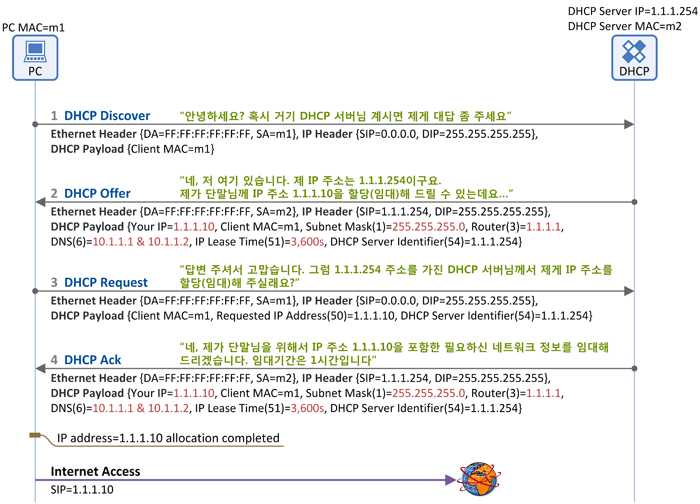

# 📚 들어가면서          
     
# 📘 DNS    
> Domain Name System     
   
**🤔 Domain?**       
```
115.68.24.88
220.95.233.172
114.108.157.19
```     
* opentutorials.org -> 115.68.24.88      
* naver.com -> 220.95.233.172        
* daum.net -> 114.108.157.19      
    
ip는 숫자로 된 식별자이다. 그렇기 때문에 사람이 일일히 이해하고 기억하기 어렵다.              
이러한 문제점을 해결하기 위해 각 ip에 이름을 부여할 수 있게 했는데, 이것을 **도메인**이라고 한다.      
        
**🤔 Domain Name System**                    
사람이 IP주소를 이해하고 활용하고자 하는 것은 좋지만 그 일을 누가하겠는가?               
결국에는 특정 서버에서 도메인값을 IP주소로 반환해주는 역할을 해야하며 이러한 작업을 하는 것이 바로 DNS 서버이다.               
즉, DNS란 특정 노드의 주소를 찾기 위해, 사람이 이해하기 쉬운 도메인 이름을 **IP 주소로 변환해주는 역할을 한다.**                 
                
## 📖 DNS Lookup                   
 
       
  
브라우저가 URL에 적힌 값을 파싱해서 HTTP Request Message를 만들고, OS에 전송 요청을 한다.      
하지만, 이 때 **IP주소가 아닌 Domain만으로 요청을 보낼 수 없기 때문에 DNS Lookup을 수행한다.**    
     
* Recursive Query : Local DNS 서버가 여러 DNS 서버를 차례대로            
`Root DNS 서버` -> `com DNS 서버` -> `naver.com DNS 서버` 질의해서 답을 찾아가는 과정        
   
DNS 룩업 과정은 `브라우저` → `hosts 파일` → `DNS Cache`의 순서로 도메인에 매칭되는 ip를 찾는다.    
일반적으로 설명하는 DNS Lookup은 루트 도메인서버에서부터 서브도메인 서버순으로 찾게된다.     
     
💡 **브라우저 주소창에 `http://www.naver.com` 입력 후 엔터를 눌렀을 때 부터 페이지가 렌더링되는 과정을 상세히 설명하세요.**        
      
1. 클라이언트에서 미리 설정되어있는 DNS(Local DNS)에게 `naver.com`대한 IP주소를 요청한다.              
2. local DNS 서버에 없다면 **루트 DNS 서버에 물어본다.** 있다면 바로 해당 ip로 받아온다. 
3. 루트 DNS 서버에 없다면 **`.com` 을 관리하는 DNS 서버에 물어본다.** 있다면 바로 해당 ip를 받아온다.
4. .com 을 관리하는 DNS 서버에 없다면, **`naver.com`을 관리하는 DNS 서버에 물어본다.** 있다면 바로 해당 ip를 받아온다.
5. 목적지의 ip를 알게되었으니 TCP 통신을 통해 소켓을 개방한다.
6. HTTP 프로토콜로 요청한다.    
7. 만약 라우팅 중 프록시 서버를 만난다면 웹 캐시에 저장된 정보를 response 받는다.    
8. 프록시 서버를 만나지 못해 `www.naver.com`을 서빙하는 서버까지 간다면 서버에서 요청에 맞는 데이터를 response로 전송한다.    
9. 브라우저의 loader가 해당 response를 다운로드할지 말지 결정을한다.       
10. 브라우저의 웹 엔진이 다운로드한 .html 파일을 파싱하여 DOM 트리를 결정한다.
11. .html 파싱중 script 태그를 만나면 파싱을 중단하는 것이 원칙(지연 가능).
12. script 태그에 있는 자원을 다운로드 하여 처리가 완료되면 다시 파싱을 재개한다.
13. CSS parser가 역시 .css 파일을 파싱하여 스타일 규칙을 DOM 트리에 추가하여 렌더 트리를 만든다.
14. 이 렌더트리를 기반으로 브라우져의 크기에 따라 각 노드들의 크기를 결정한다.
15. 페인트한다 : 렌더링 엔진이 배치를 시작한다.
  
[참고](https://kadamon.tistory.com/22)    
  
# 📗 DHCP  
> **Dynamic Host Configuration Protocol**는 네트워크 조직의 호스트에게 **동적으로 IP를 할당하는 프로토콜**               
                  
DHCP는 우리가 사용하는 공유기와 같이 사설망의 장치에게 동적으로 IP를 할당해주는 것이다.      
공유기를 사용해본 경험이 있다면 `192.168~`로 시작하는 IP를 할당받은 기억이 있을 것이다.       
     
개인 또는 소규모 사업체의 경우 공유기등을 이용하여 **사설 IP를 할당받아 사용**하거나,            
각 호스트별로 IP를 관리자가 직접 할당하지만, 호스트가 네트워크 케이블을 연결함과 동시에         
**자동으로 IP를 할당받아 통신이 될 필요가 있으면서, 연결된 호스트 IP를 정해진 규칙에 맞에 관리할 필요가 있다면**       
DHCP를 선택하는 방법이 좋다.                  
            
1. IP관리가 편하다 : DHCP서버에서 IP를 자동적으로 할당해 주므로 IP충돌을 예방할 수 있기 때문이다.         
2. 네트워크 연결 설정 시간 단축 : 이동식 PC를 네트워크와 연결할 때 특별한 설정 없이 사용할 수 있다. (WIFI)           
   
    
## 📖 DHCP 구성          
**DHCP 클라이언트**            
* DHCP서버에 자신의 IP를 요청하고 IP를 부여받고 나면 TCP/IP 통신을 할 수 있다.          
    
**DHCP 서버**          
* 클라이언트로부터 IP할당 요청이 들어오면          
설정된 범위안에서 사용하고 있지 않은 IP를 클라이언트에 부여하여 할당 가능한 IP들의 영역을 관리합니다.       
          
**DHCP 프로토콜**          
* BOOTP메시지 형식을 사용한다.           
* IP주소와 TCP/IP프로토콜 기본 설정을 개별 클라이언트에 자동적으로 할당하는 역할을 합니다.        
         
이렇게 IP를 편하게 관리할수 있어 DHCP를 많이 사용하고 있습니다.      
다음에 시간이 되면 DHCP설정하는 방법에 대해서 올리도록 하겠습니다.        
                 
## 📖 DHCP의 장점   
DHCP 이전에는 네트워크 관리자가 Mac주소-IP주소를 직접 맵핑하여 서버에 저장해두고   
노드가 재부팅되면 BOOTP 프로토콜 이용하여 서버로부터 IP를 알아오는 방식이었다.       
이러한 방식은 매번 새로운 IP장비를 연결할 때마다 관리자가 직접 IP주소와 Mac주소를 맵핑시켜줘야 할 필요가 있다.       
하지만, DHCP 방식이 도입되면서 자동으로 PC에 IP주소를 할당해주어 이러한 불편함을 해소시켰다.      
    
## 📖 DHCP의 단점      
DHCP는 서버가 자동으로 IP를 할당하기 때문에 몇가지 문제가 발생할 수 있다.    
예를 들면, A가 연결을 해제하면 A가 가지고 있던 IP주소를 B나, C 컴퓨터가 받을 수 있다.  
일반적인 경우 문제는 없지만 포트포워딩같은 서비스를 이용하는 경우 이를 다시 셋팅해줘야 한다.  
이는, 정전이 나거나 공유기가 갑작스럽게 재부팅 될 때도 마찬가지다.     
           
또한, 악의적인 공격으로 서버의 IP 자원이 고갈될 우려가 있다.             
UDP기반 프로토콜로 네트워크 부하에 따라 IP할당이 지연되거나 실패할 수도 있다.       
    
## 📖 DHCP 원리      

    
[사진 출처](https://www.netmanias.com/ko/post/blog/5348/dhcp-ip-allocation-network-protocol/understanding-the-basic-operations-of-dhcp)   
   
DHCP를 통한 IP 주소 할당은 **`임대`** 라는 개념을 가지고 있다.        
이는 DHCP 서버가 IP 주소를 영구적으로 단말에 할당하는 것이 아니고     
**임대기간(IP Lease Time)을 명시하여 그 기간 동안만 단말이 IP 주소를 사용하도록 하는 것을 의미한다.**    
  
단말은 임대기간 이후에도 계속 해당 IP 주소를 사용하고자 한다면       
IP 주소 **임대기간 연장(IP Address Renewal)** 을 DHCP 서버에 요청해야 하고      
또한 단말은 임대 받은 IP 주소가 더 이상 필요치 않게 되면 IP 주소 **반납 절차(IP Address Release)** 를 수행하면 된다.   

### 📄 DHCP Discover
  
* 메시지 방향: 단말 -> DHCP 서버    
* 의미: 단말이 DHCP 서버를 찾기 위한 메시지다.    
그래서 LAN상에(동일 subent상에) **브로드캐스팅을 하여 
`거기 혹시 DHCP 서버 있으면 내게 응답 좀 해 주세요~`라고 단말이 외친다.**          
 
### 📄 DHCP Offer

* 메시지 방향: DHCP 서버 -> 단말
* 의미: DHCP 서버가 "저 여기 있어요~"라고 응답하는 메시지다.   
단순히 DHCP 서버의 존재만을 알리지 않고,   
단말에 **할당할 IP 주소 정보를 포함한 다양한 `네트워크 정보`를 함께 실어서 단말에 전달**합니다.
 
### 📄 DHCP Request  

* 메시지 방향: 단말 -> DHCP 서버   
* 의미: 단말은 DHCP 서버(들)의 존재를 알았고,      
DHCP 서버가 단말에 제공할 네트워크 정보(IP 주소, subnet mask, default gateway등)를 알았다.       
이제 단말은 **DHCP Request 메시지를 통해 하나의 DHCP 서버를 선택하고 
해당 서버에게 "단말이 사용할 네트워크 정보"를 요청**한다.        
   
### 📄 DHCP Ack   
* 메시지 방향: DHCP 서버 -> 단말  
* 의미: DHCP 절차의 마지막 메시지로, **DHCP 서버가 단말에게 "네트워크 정보"를 전달해 주는 메시지**다.       
앞서 설명드린 DHCP Offer의 '네트워크 정보"와 동일한 파라미터가 포함된다.     
   
이렇게 DHCP Ack를 수신한 단말은 이제 IP 주소를 포함한 네트워크 정보를 획득(임대)하였고,    
**이제 인터넷 사용이 가능하게 된다.**   


