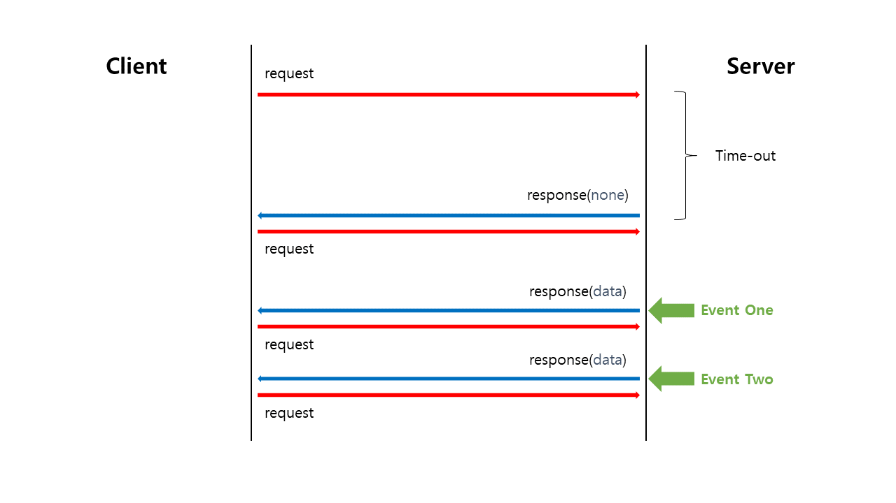
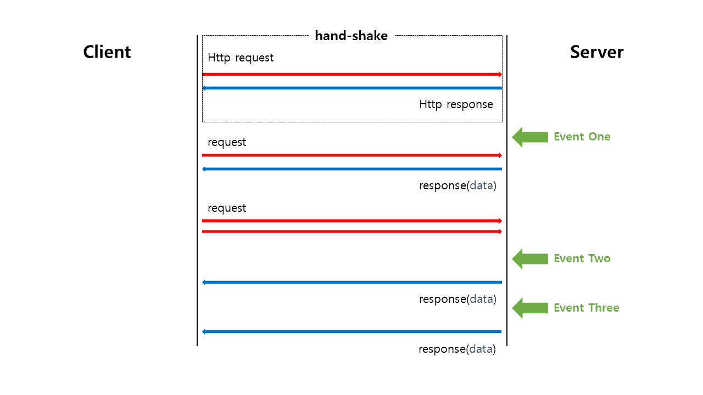
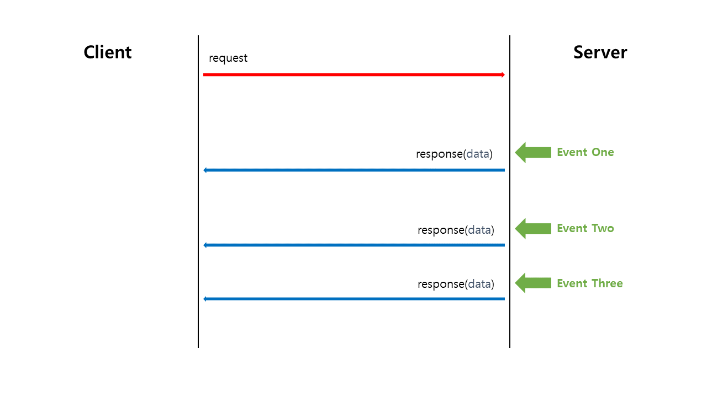

# 08 RealTimeWeb
## Realtime Web     
> 인터넷에서 사용자들로 하여금 창작자가 정보를 만들어내는 즉시 수신할 수 있도록하는 기술 혹은 서비스   

**전통적인 웹**   
* 웹은 HTTP-요청-응답 모델을 기반으로 구축됐다.      
* HTTP는 무상태 프로토콜이며 클라이언트와 서버 간의 통신은 각각의 독립적인 요청과 응답의 쌍으로 구성된다.    
* 웹 브라우저에서 폼을 채우고 이를 웹 서버로 제출하는 하나의 요청으로    
웹 서버는 요청된 내용에 따라서 데이터를 가공하여 새로운 웹 페이지를 작성하고 응답으로 되돌려준다. 
   
이 같이 요청이 있을 때마다 페이지를 새로 그리는 작업을 `포스트 백`이라 부른다.    
   
**AJAX의 등장**        
* 사용자 인터페이스 나머지 부분을 방해하지 않고 비동기로 데이터를 송/수신할 수 있다.       
* 전체 페이지를 다시 로딩하는 것이 아닌 일부분만 변경하기 때문에 빠른 화면 전환이 가능하다.   
            
**추가 정리**               
위 내용을 읽으면서 헷갈릴 수 있는 부분이 있을 것 같아 조금 더 설명을 하고자 한다.               
전통적인 웹에서 Request로 받는 것은 `웹페이지`뿐만 아니라 특정 부분의 `데이터`도 받을 수 있다.    
우리가 알만한 내용으로 말하자면, Controller 방식과 RestController 방식 둘다 사용할 수 있다.   
단, 문제가 무엇이냐면 페이지를 새로 받는다 하면 이를 다시 로드해야하고         
특정 부분의 데이터를 받는다 하더라도 이를 반영하기 위해서는 `페이지를 로드`해야한다.        
결국, 데이터의 수정이 이루어지면 결과물이 어떻든 페이지를 리로딩해야 한다는 것이다.              
하지만, 이때 등장한 것이 **비동기 방식의 `AJAX`** 이다.             
비동기 방식은 `이벤트 루프` 기반으로 기존 작업을 수행하고 있다가         
이벤트가 발생하면(위 같은 상황이면 응답이 왔을 경우)이에 맞는 처리를 할 수 있다.      
   
## Polling       
   

**Client : javascript**
```javascript
const delay = (ms) => new Promise((resolve) => setTimeout(resolve, ms))

const fetchPosts = (cursor) =>
  fetch('/api/posts?cursor=&{cursor}')
    .then((response) => response.json())
    .then(prependPosts)
   
async function polling() {
  while (true) {
    await delay(1000)  
    await fetchPosts($posts.firstElementChild.dataset.postId)
  }
}   

fetchPosts(0).then(polling)  
```
**Controller : webflux**
```java
@GetMapping
fun getPosts(@RequestParam cursor: Long): ResponseEntity<List<PostResponse>> {
	return RepositoryEntity.ok(postService.getPosts(cursor))
}
```
**Service : webflux**
```java
fun getPosts(cursor: Long = 0L): List<PostResponse> = postRepository
    .findByIdGreaterThan(cursor)
    .map( it. toResponse) }
```
Polling 이란, 클라이언트가 서버에게 주기적으로 Request를 보내는 방식을 의미한다.              
서버가 클라이언트에게 알려야 할 이벤트가 주기적으로 발생할 때에는 비용 대비 효과가 가장 좋다는 특징을 가지고 있다.   
단, 이때 전송할 데이터의 유무를 따지지 않기 때문에 Response로는 빈 데이터/실패 데이터를 받는다.      
   
우선, Polling의 장점과 단점은 아래와 같다.      
     
**Polling의 장점**         
1. 주기적으로 물어보므로 응답 간격을 일정하게 할 수 있다.     
2. 주기적으로 몰아서 물어보는게 가능하므로 자동으로 **배치프로세싱(일괄처리)되어서 db튜닝을 하는 효과**가 나온다.     
3. 요청/응답이 주기적으로 일정하기 때문에 네트워크 부하를 예측할 수 있는 일정 수준으로 정적으로 유지할 수 있다. 
4. 특정 주기를 가지고 그 주기 마다 처리를 위한 시그널이 들어 왔는지를 체크 하기에     
따라서 커널과 같은 `Interrupt Handler`가 필요하지 않는다.       
    
**Polling 의 단점**                  
1. 실시간과 비슷한 효과를 내려면 요청 간격을 줄여야 하지만 서버와 클라이언트 모두에게 부담이다.             
2. 서버에서는 보낼 데이터가 없어도 계속해서 데이터를 줘야하므로(공백/실패) 서버의 리소스를 낭비하게된다.          
3. 요청이 서버로 **전송되는 데 소요되는 시간**도 불규칙할 수 있기에, 클라이언트의 주기와 서버의 주기가 엇갈리는 때도 많다.     
     
이렇듯 Polling 기법은 단순하지만, 너무 많은 `Requset/Response`전송, `Resource` 사용으로        
클라이언트와 서버 양쪽에 무리를 주는 단점이 있고            
무엇보다 `Polling` 방식에 초점을 두어 프로그래밍을 해야 한다는 문제가 있다. (완벽한 Polling을 위해)            
   
## Long Polling   
Long Polling 방식은 일반 Polling 방식과 포맷은 같다.        
단, Polling 방식과의 차이점으로는 `time out`될 때까지 기다린다는 것이다.     
       
         

**Client : javascript**
```javascript
create longPolling = () =>   
  fetch("/api/posts/long-polling")
    .then((response) => response.json())
    .then((prependPosts))
    .then(longPolling)   

fetchPosts(0).then(longPolling)
```
**Controller : webflux**
```java
@GetMapping("/long-polling")
fun longPolling(): Mono<PostResponse> = postService.longPolling();
```
    
**Service : webflux**
```java
fun writePost(request: PostRequest)  {
	val response = postRepository.save(request.toPost())
			.toResponse()
	waits.forEach { it.success(response) }
}

fun longPolling(): Mono<PostResponse> = Mono.create {
	it.onDispose { wait.remove(it) }
	waits.add(it)
}
```

Long Polling 방식은 요청을 보내고 **제한시간내에 이벤트가 발생하면 데이터를 받는 방식**이다.                    
만약 데이터를 받지 못했다 하더라도, `Clinet`에서는 바로 다시 서버에 요청을 보낸다.                       
이 결과, 연결은 무한히 지속되게 되며 client는 마치 실시간으로 데이터를 받는 느낌을 받게 된다.            
LongPolling은 Polling과 조금 다르게 **지속적인 연결을 목표로 하고 있다.**                  
그렇기에 서버로부터 응답을 받을 때만 다시 요청을 날리는 방식으로 Polling의 문제점을 해결했다.             
            
**하지만,** LongPolling에도 단점은 존재한다.            
데이터가 주어지는 즉시 바로바로 반응하고 보내므로          
**이벤트 발생 빈도가 매우 높을 때에는, Polling보다 더 큰 네트워크 부하가 발생**할 수 있다.             
       
따라서 이벤트 발생 빈도가 높은 상황에서 Long Polling을 적용할 때에는,      
[네이글 알고리즘(Nagle's Algorithm)](https://snowdeer.github.io/common-sense/2017/08/17/nagle-algorithm/)의 도입을 검토해서 과도한 부하 발생을 방지하는 보완 조치가 필요하다.  
         
**네이글 알고리즘**에 대해서 쉽게 설명하면           
우선 순위가 높은 메시지는 즉각 회신하도록 하고,          
우선 순위가 낮은 메시지는 개수 또는 크기 기준으로 일정량을 넘을 때만 서버가 응답을 보내는 알고리즘이다.    
**버퍼와 같은 동작을 처리하는 알고리즘이라 생각하면 된다.**       
      

## Socket 
          
     
웹소켓은 **`하나의 TCP 연결 위`에서 `전이중(full-duplex) 통신` `채널`** 을 제공하는 프로토콜이다.             
웹소켓을 진정한 실시간 웹 기술이라고 할 수 있는 이유는 `하나의 TCP 연결`과 `전이중`이라는 단어에 담겨있다.       
          	     
`Polling/Long Polling`은 그 정도에 차이가 있을 뿐, **연결 지속성이 없다는 공통된 특징을 가지고 있다**           
실시간성을 확보하기 위해 클라이언트가 서버에 계속 새로운 HTTP 연결을 생성하는데, 이는 꽤 많은 오버헤드를 유발한다.       
또한, 기존의 HTTP는 기본적으로 요청-응답 패러다임으로 양방향 통신이 가능하기는 하지만    
**클라이언트와 서버가 동시에 상대방에게 데이터를 전송할 수 없는 반이중 통신**을 지원한다.        
반이중 통신은 동시에 서로에게 전송해야 할 데이터가 있는 경우 경합이 발생하고,            
**채널이 사용 가능 해질 때까지 대기 해야하므로 지연 발생의 원인이 된다.**         
        
웹소켓은 하나의 TCP 연결로 불필요한 연결 오버헤드를 줄일 수 있고,         
전이중 통신을 지원해서 연결 지연을 줄일 수 있으므로,         
`Polling` 기반의 전통적인 실시간 웹 기술에 비해 성능 면에서 훨씬 뛰어나다.       
    
하지만, `socket` 만을 위한 별도의 서버와 프로토콜로 통신하기 때문에 구현하는 비용이 많이 든다
    
## Server-sent event(SSE)     
   
   
```javascript  
const subscribe = () => {
    const subcriber = new EventSource("/api/posts/subscribe")
    subscriber.onmessage = (e) => {
        prependPosts(JSON.parse(e.data))  
    }
}

fetchPosts(0).then(subscribe)     
```
```java
@GetMapping("/subscribe", produces = [MediaType.TEXT_EVENT_STREAM_VALUE]) 
fun subscribe(): Flux<PostResponse> = postService.subscribe()   
```   
```java
fun writePosts(request: PostRequest) {
    val response = postRepository.save(request.toPost())
        .toResponse()
    subscribes.forEach { it.next(response) }      	
}

fun subscribe(): Flux<PostResponse> = Flux.create {
    it.onDispose {subscribers.remove(it)}  
    subscribers.add(it)
}
```   

SSE는 `Server-sent event`의 약어로 **서버의 데이터를 실시간으로, 지속적으로 Streaming 하는 기술**이다.         
HTTP 스트리밍 방식이라고도 하며 SSE 사양에 따라 구현한 통신 방식이다.        
           
HTTP를 사용한 [서버 푸시](https://en.wikipedia.org/wiki/Push_technology) 방법이며     
서버 이벤트가 발생하면 응답을 완료하여 연결을 끊는게 아니라 응답 스트림에 청크 단위 데이터를 계속 보낸다.                 
즉, 클라이언트가 요청을 보내면 서버는 무기한 연결을 유지하고 준비가 되면 지속적으로 데이터를 보낸다.           
     
기존에는 서버의 변경된 데이터를 가져오기 위해서 아래와 같은 작업을 했다.       
     
* 페이지 새로고침    
* ajax 폴링  
* websocket      
* 외부 플러그인   
   
페이지 새로고침을 개선하기 위해, ajax 폴링 기법이 등장했고      
ajax 폴링 기법을 개선하기 위해 socket이 등장했다.     
하지만, socket 또한  socket 만을 위한 별도의 서버와 프로토콜로 통신하기 때문에 구현하는 비용이 많이 든다는 단점이 있다.    
        
SSE는 기존 HTTP 웹 서버에서 `HTTP API` 만으로 동작되며 구현도 간단하기 때문에        
서버와 프론트엔드 양측 모두 매우 쉽게 개발이 가능하다는 장점이 있다.            
      
하지만, 서버 푸시 기반이기에 양방향 통신에는 비교적 적합하지 않다.       
그렇기에 실시간 채팅처럼 클라이언트와 서버가 양방향으로 데이터를 주고받는 경우에는 웹소켓이 더 적합하다.          

# 기술 선택 
* Polling :   
  * 서버 개발을 할 수 없는 상황이다.  
  * 외부 API가 서버 푸시를 지원하지 않는다.  
* ~~LongPollong    
* Webscocket
  * 네트워크 지연을 최소화해야 한다.  
  * 채팅, 게임과 같이 사용자간 빠른 피드백이 이루어져야 한다.  
* Server-sent-events    
  * 새로운 데이터를 즉시 수신만 해도 된다.     
  * 알림, 실시간 댓글 등을 구현해야 한다.        


# 개인적인 궁금증 다 같이 토론해봐요👨‍🏫
비동기 방식이 아니면 꼭 리프레시해야하나요?      
동기 비동기는 사실, 계속 일을 처리하냐? 아니면 대기상태에 있다가 응답이 오면 실행하는 것        
그럼 대기상태에 있다가 데이터를 받고 이를 JS로 업데이트 시킬 수 있지 않을까?       
페이지 로딩 조건이 따로 있나? 생각이듭니다.   


