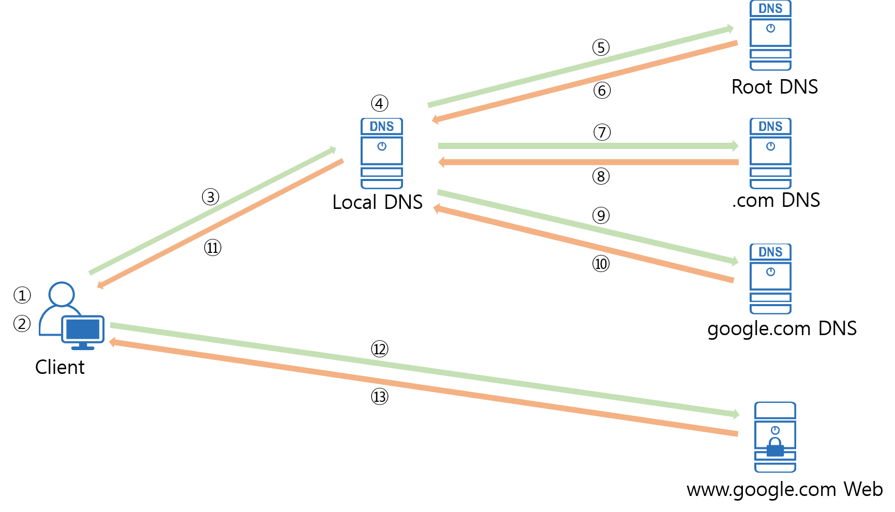

# DNS & DHCP

#### Reference
- [DHCP서버 - 이론(유튜브 영상)](https://youtu.be/j9_eK_bQeWU)
- [DHCP, DNS란 무엇인가?](https://www.crocus.co.kr/1414)
- [더 편리한 인터넷을 위해 - DHCP&&DNS 프로토콜](https://velog.io/@hidaehyunlee/%EB%8D%94-%ED%8E%B8%EB%A6%AC%ED%95%9C-%EC%9D%B8%ED%84%B0%EB%84%B7%EC%9D%84-%EC%9C%84%ED%95%B4-DHCP-DNS-%ED%94%84%EB%A1%9C%ED%86%A0%EC%BD%9C)
- [생활코딩 DNS](https://opentutorials.org/course/3276/20299)

---

### DNS의 등장
- 인터넷에 연결된 컴퓨터 하나 하나를 `host`라고한다.
- host가 서로 통신을 하기 위해서는 서로의 주소가 필요하다.
- 이 주소를 `IP 주소`라고한다.
- `IP 주소`를 기억하는 것은 꽤 어려운 일이다.
- 이 문제를 해결하기 위해서 `Domain Name System`이 등장한다.
- `Domain`은 `IP 주소`에 이름을 붙여 기억하기 쉽게 만들어준다.

### DNS Server
1. 우리가 알고있는 웹 사이트의 주소를 입력해서 접속하면
2. 운영체제는 DNS server에 접속해서
3. 해당 주소의 IP주소를 물어보고, DNS Server는 이 IP주소를 알려주고, 이를 통해 해당 사이트에 접속할 수 있게 된다.

### DNS 쿼리
DNS 서버는 사용자가 도메인 이름을 브라우저에 입력하면, 사용자를 어떤 서버에 연결할 것인지 제어한다. 이러한 요청을 __`쿼리`__ 라고 한다.

### DNS의 구성 요소
- __도메인 네임 스페이스 (Domain Name Space)__
    - DNS는 거대한 분산 네이밍 시스템이며, 도메인 네임 스페이스는 이러한 DNS가 저장/관리하는 계층적 구조를 의미한다.
    - 최상위 Root DNS 서버가 존재하고, 그 하위로 인터넷에 연결된 모든 노드가 연속해서 이어진 계층 구조로 구성되어 있다. 각 레벨(Top level, Second level등)의 도메인은 그 하위 도메인에 관한 정보를 관리하는 구조이다.
- __네임 서버 (Name Server)__
    - 문자열로 표현된 도메인 이름을 실제 컴퓨터가 통신할 때 사용하는 숫자로 표현된 IP 주소로 변환하는 시켜주어야한다. 
    - 이러한 동작을 위해서는 도메인 네임 스페이스의 트리 구조에 대한 정보가 필요하며, 이러한 정보를 가지고 있는 서버를 `네임 서버`라고 한다.
    - 즉, 도메인 이름을 IP 주소로 변환하는 것을 `네임 서비스`라고 하며 `리졸버(Resolver)`로 부터 요청 받은 도메인 이름에 대한 IP정보를 다시 리졸버로 전달해주는 역할을 수행하는 것이 네임 서버이다.
- __리졸버 (Resolver, 재귀 확인자)__
    - 리졸버는 웹 브라우저와 같은 DNS 클라이언트의 요청을 네임 서버로 전달하고 네임 서버로부터 정보(도메인 이름과 IP 주소)를 받아 클라이언트에게 제공하는 기능을 수행한다. 
    - 이 과정에서 리졸버는 하나의 네임 서버에게 DNS 요청을 전달하고 해당 서버에 정보가 없으면 다른 네임 서버에게 요청을 보내 정보를 받아 온다.

### DNS 서비스 유형
__1. 신뢰할 수 있는 DNS__
- 개발자가 퍼블릭 DNS 이름을 관리하는 데 사용하는 업데이트 메커니즘을 제공한다.
- 이를 통해 DNS 쿼리에 응답하여 도메인 이름을 IP 주소로 변환한다.
- 신뢰할 수 있는 DNS는 도메인에 대해 최종 권한이 있다.
- 재귀적 DNS 서버에 IP 주소 정보가 담긴 답을 제공할 책임이 있다.
- IP 주소를 확인하는 확인자의 마지막 단계이다.

__2. 재귀적 DNS__
- 보통 클라이언트는 신뢰할 수 있는 DNS 서비스에 직접 쿼리를 수행하지 않는다.
- 해석기 또는 재귀적 DNS 서비스라고 알려진 다른 유형의 DNS 서비스에 연결하는 경우가 일반적이다.
- DNS 레코드를 소유하고 있지 않지만 사용자를 대신해서 DNS 정보를 가져올 수 있는 중간자의 역할을 한다.
- 일정 기간 동안 캐시된 또는 저장된 DNS 레퍼런스를 가지고 있는 경우, 소스 또는 IP 정보를 제공하여 DNS 쿼리에 답을 하거나, 해당 정보를 찾기 위해 쿼리를 하나 이상의 신뢰할 수 있는 DNS 서버에 전달한다.

### DNS 동작 방식

 

__Clinet가 `www.google.com`을 주소창에 입력했을 때 화면에 보여지기 까지의 과정을 알아보자.__
1. PC의 호스트 파일에 www.google.com에 대한 IP 주소 정보가 있는 지 확인한다.
    - 윈도우 : c:\windows\system32\drivers\etc\hosts
    - 리눅스 : /etc/hosts
2. PC의 DNS 캐시에 www.google.com에 대한 IP 주소가 있는 지 확인한다.
3. Local DNS에 www.google.com에 대한 DNS query 를 보낸다.
    - Local DNS는 PC에 설정되어 있는 네임서버이다.
    - 예> 168.126.63.1 ( KT DNS ), 8.8.8.8 ( google DNS ) 등
4. Local DNS의 DNS 캐시 정보에 www.google.com에 대한 IP 주소가 있는 지 확인한다.
5. Local DNS는 Root DNS 에 www.google.com 에 대한 IP 주소를 요청하는 DNS query를 보낸다.
6. Root DNS는 자신의 존 파일에 정보가 있다면 IP 주소를 응답하고, 없다면 COM의 DNS 서버 주소를 응답한다.
7. Local DNS는 Root DNS에서 받은 COM DNS에 www.google.com에 대한 IP 주소 정보를 요청하는 DNS query를 보낸니다.
8. COM DNS는 자신의 존 파일에 정보가 있다면 IP 주소를 응답하고, 없다면 google.com의 DNS 서버 주소를 응답한다.
9. Local DNS는 COM DNS에서 받은 google.com DNS에 www.google.com에 대한 IP 주소 정보를 요청하는 DNS query를 보냅니다.
10. google.com DNS는 존 파일 정보를 확인하여 IP 주소를 응답한다.

---

### DHCP 프로토콜
> 동적 호스트 설정 프로토콜(Dynamic Host Configuration Protocol)로서 해당 호스트에게 `IP주소`, `서브넷 마스크`, `기본게이트웨이 IP주소`, `DNS서버 IP주소` 를 자동으로 일정 시간 할당해주는 인터넷 프로토콜

- DHCP를 통한 IP 주소 할당은 DHCP 서버가 IP 주소를 영구적으로 단말에 할당하는 것이 아니고 임대기간(IP Lease Time)을 명시하여 그 기간 동안만 단말이 IP 주소를 사용하도록 한다. 

- 임대기간 이후에도 계속 단말에서 해당 IP 주소를 사용하고자 한다면 IP 주소 임대기간 갱신(IP Address Renewal)을 DHCP 서버에 요청해야 한다.

- 만약, 단말은 임대 받은 IP 주소가 더 이상 필요치 않게 되면 IP 주소 반납 절차(IP Address Release)를 수행한다.

### DHCP의 구성
#### 1. DHCP 서버
- DHCP서버는 인터넷을 제공해주는 곳의 서버에서 실행되는 프로그램으로 일정한 범위의 IP주소를 다른 클라이언트에게 할당하여 자동으로 설정하게 해주는 역할을 한다. 
- DHCP서버는 클라이언트에게 할당된 IP주소를 변경없이 유지해 줄 수 있다. 

__DHCP가 설정해주는 주소 정보__

|항목|	결과|
|---|---|
|IP 주소|	192.168.0.4|
|서브넷 마스크|255.255.255.0|
|기본 게이트웨이|	192.168.0.1|
|DNS 서버 IP 주소|	210.220.163.82 / 219.250.363.130|

#### 2. DHCP 클라이언트
- 클라이언트들은 시스템이 시작하면 DHCP서버에
 자신의 시스템을 위한 IP주소를 요청하고, DHCP 서버로부터 IP주소를 부여받으면 TCP/IP 설정은 초기화되고 다른 호스트와 TCP/IP를 사용해서 통신을 할 수 있게 된다.
- 즉, 서버에게 IP를 할당받으면 TCP/IP 통신을 할 수 있다.

 

### DHCP 할당 절차

 

#### 1. DHCP Discover
- 패킷 방향 : 클라이언트 -> DHCP 서버
- 브로드캐스트 패킷 : Destination MAC = FF:FF:FF:FF:FF:FF
- 이더넷 프로토콜의 MAC주소를 브로드캐스트 주소로 보내게 된다.
- 같은 네트워크 대역에 있는 모든 PC들이 이 패킷을 받게 된다.
- DHCP서버로 동작하는 것이 있으면 응답하고, 아니면 무시한다.
- 의미 : 클라이언트가 DHCP 서버를 찾기 위한 메시지. 
    - LAN상에(동일 subent상에) 브로드캐스팅을 하여 "거기 혹시 DHCP 서버 있으면 내게 응답 좀 해 주세요"라고 단말이 메세지를 보낸다. 
    - 이 Discover 패킷에는 IP 주소가 필요한 호스트의 MAC 주소가 담겨져 있어서 DHCP 서버가 응답할 때 패킷을 수신할 수 있게 된다.
- 주요 파라미터(패킷 내용) :
    - Client MAC : 클라이언트의 MAC 주소
- __같은 대역의 네트워크에 DHCP 서버가 있나~?__

#### 2. DHCP Offer
- 패킷 방향 : DHCP 서버 -> 클라이언트
- 브로드캐스트 메시지 : Destination MAC = FF:FF:FF:FF:FF:FF 혹은 유니캐스트. (응답 방법)
    - 이는 클라이언트가 보낸 DHCP Discover 메시지 내의 Broadcast Flag의 값에 따라 달라지는데, 이 Flag=1이면 DHCP 서버는 DHCP Offer 메시지를 Broadcast로, Flag=0이면 Unicast로 보내게 된다.
- 의미: DHCP 서버가 "저 여기 있어요~"라고 응답하는 메시지. 
    - __내가 바로 DHCP 서버다!__
    - 단순히 DHCP 서버의 존재만을 알리지 않고, __클라이언트에 할당할 IP 주소 정보를 포함한 다양한 "네트워크 정보"를 함께 실어서 클라이언트에 전달한다.__
- 주요 파라미터(패킷 내용) :
    - Client MAC: 단말의 MAC 주소
    - Your IP: 단말에 할당(임대)할 IP 주소
    - Subnet Mask (Option 1)
    - Router (Option 3): 단말의 Default Gateway IP 주소
    - DNS (Option 6): DNS 서버 IP 주소
    - IP Lease Time (Option 51): 단말이 IP 주소(Your IP)를 사용(임대)할 수 있는 기간(시간)
    - DHCP Server Identifier (Option 54): 본 메시지(DHCP Offer)를 보낸 DHCP 서버의 주소. 2개 이상의 DHCP 서버가 DHCP Offer를 보낼 수 있으므로 각 DHCP 서버는 자신의 IP 주소를 본 필드에 넣어서 단말에 보냄.

#### 3. DHCP Request
- 패킷 방향: 클라이언트 -> DHCP 서버
- 브로드캐스트 메시지 : Destination MAC = FF:FF:FF:FF:FF:FF
- 의미 : 단말은 DHCP 서버(들)의 존재를 알았고, DHCP 서버가 단말에 제공할 네트워크 정보(IP 주소, subnet mask, default gateway등)를 알았다. 
    - 이제 단말은 DHCP Request 메시지를 통해 하나의 DHCP 서버를 선택하고 해당 서버에게 "단말이 사용할 네트워크 정보"를 요청한다.
    - __당신이 DHCP 서버군요. IP주소좀 할당받을 수 있게 해주세요~__
- 주요 파라미터(패킷 내용) :
    - Client MAC: 단말의 MAC 주소
    - Requested IP Address (Option 50): 난 이 IP 주소를 사용하겠다. (DHCP Offer의 Your IP 주소가 여기에 들어감)
    - DHCP Server Identifier (Option 54): 2대 이상의 DHCP 서버가 DHCP Offer를 보낸 경우, 단말은 이 중에 마음에 드는 DHCP 서버 하나를 고르게 되고, 그 서버의 IP 주소가 여기에 들어감. 즉, DHCP Server Identifier에 명시된 DHCP 서버에게 "DHCP Request" 메시지를 보내어 단말 IP 주소를 포함한 네트워크 정보를 얻는 것.

#### 4. DHCP Ack
- 패킷 방향: DHCP 서버 -> 클라이언트
- 브로드캐스트 메시지 : Destination MAC = FF:FF:FF:FF:FF:FF 혹은 유니캐스트.
    - 이는 단말이 보낸 DHCP Request 메시지 내의 Broadcast Flag=1이면 DHCP 서버는 DHCP Ack 메시지를 Broadcast로, Flag=0이면 Unicast로 보내게 된다.
- 의미: 
    - DHCP 절차의 마지막 메시지로, DHCP 서버가 단말에게 "네트워크 정보"를 전달해 주는 메시지.
    - 앞서 설명한 DHCP Offer의 '네트워크 정보"와 동일한 파라미터가 포함된다.
- __IP주소 여기있고, 언제까지 써라~__
- 주요 파라미터(패킷 내용) : DHCP Request 패킷의 파라미터와 동일

