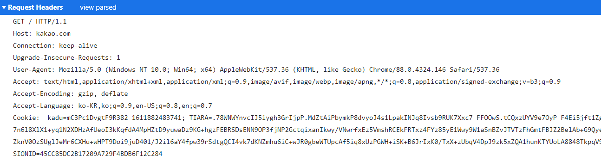
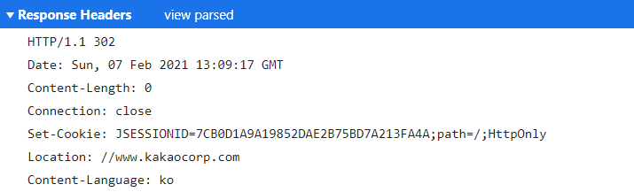

# HTTP & HTTPS

### 개요

>__클라이언트는 서버에게 요청(request)하고__
>__서버는 클라이언트에게 응답(response)한다.__

1. HTML, CSS, 자바스크립트는 컨텐츠이고, 그 컨텐츠를 주고받기 위해서 서버와 클라이언트가 서로가 알아들을 수 있는 공통의 약속인 메시지가 필요하다.

2. 이 메시지를 HTTP라고 하고 HTTP는 Response와 Request로 구분된다.

#### Reference
- [생활코딩 HTTP](https://opentutorials.org/course/3385)
- [인터넷 프로토콜 http와 https의 차이는 뭘까? 보안과 마케팅 측명에서 살펴보기](https://post.naver.com/viewer/postView.nhn?volumeNo=16561296&memberNo=1834)

---

### HTTP란?
- `Hyper Text Transfer Protocol`의 두문자어로, 인터넷에서 데이터를 주고받을 수 있는 프로토콜.

### 개발자 도구로 확인해보기 요약
- 크롬 - 우클릭 - 검사 - 네트워크 탭(웹브라우저와 웹서버가 어떤 통신을 하고있는지 모니터링 할 수 있는 툴)
- 리로드 해보면 수 많은 파일들이 로드되는 것을 확인할 수 있음.

- 접속페이지의 html을 확인하면 내부 소스 코드에서 다른 파일들을 리로드 하는 것을 확인 할 수 있음.
- 우리가 새로고침 버튼을 눌러 확인하면 이 html에서 불러온 다양한 파일들이 함께 리로드 되는 것이다.

- 파일을 하나 클릭하고 Headers라는 탭을 확인하면 HTTP 메세지를 볼 수 있다.
- Request Hedaers는 웹브라우저가 웹서버에게 요청한 내용을 확인할 수 있다.
    - view source를 누르면 날 것 그대로를 볼 수 있는데, 이 내용 그대로 웹 브라우저가 웹 서버에게 보낸 것.
    - `Get 방식`으로 / 해당 파일을 요청하면서 지금 내가 사용할 수 있는 통신방법은  `HTTP/1.1`이다. 라는 것을 보여줌
    - Host : 이 주소로 접속했다.

- Response Headers의 View source
    - 첫 줄에는 약속된 내용을 적는다.
        - 통신 방법 : 나도 HTTP/1.1로 통신할거야.
        - 상태코드 : ex) 200 성공적으로 데이터를 찾아서 너한테 보냈어.
    - 그 외
        - content-Length : 컨텐츠의 길이
        - contet-Type : 응답한 파일의 타입

### 웹 브라우저가 하는역할
- 사용자가 원하는 정보를 텍스트 형식(요청 헤더)로 만들어서 웹 - 서버에게 전달
- 웹 서버가 보내준 파일들을 적당히 그려준다.

### 웹 서버가 하는 역할
- 자기가 가지고 있는 정보를 보내주면서 응답 헤더를 만들어둔다.

### HTTP 파헤쳐보기
- #### Request Headers
    

 

    

 
    
    - __Request Message Header__
        - __Request Line__ : 첫 줄, 요청행
            - Get : HTTP Method, 데이터를 웹 서버로부터 가져올 때
            - /doc/test.html : 웹 서버에게 요청한 정보
            - HTTP/1.1 : 웹 브라우저가 사용하고 있는, 사용할 수 있는 HTTP버전
        - __Request Headers__ : 헤더 정보
            - Host : 요청하는 웹 서버의 주소, 
                - 참고) 하나의 웹 서버가 여러 개의 도메인을 서비스할 수 있다. 이 경우, 이 Host의 주소에 따라서 다른 정보를 제공할 수 있다.
                - 8080 : 포트 번호
            - User-Agent : 웹 브라우저의 다른 표현으로 OS버전, 웹브라우저의 종류 등을 표시한다.
            - Accept-Endcoding : 웹 브라우저와 웹 서버가 통신할 때, 응답하는 데이터의 양이 많으면 압축해서 전송한다. 이 부분은 사용하는 웹 브라우저가 어떤 압축방식을 지원하는지 표시한다.
            - If-Modified-Since : 내가 가지고 있는 이 파일은 마지막으로 언제 다운로드 받은 파일인지 말해줌.
                - 웹서버는 자기가 가지고있는 파일이랑 비교해서 최신버전과 같으면 전송하지 않아서 전송량, 속도 측면에서 효율을 높인다.

- #### Response Headers
    

 
    

 

    - __status__ : 첫 행, 상태
        - version : HTTP의 버전
        - status code : 응답 결과
        - phrase : 응답 결과를 사람이 이해하기 쉽도록 말로 풀어씀
    - __headers__ : 헤더 정보
        - Content-Type : 컨텐츠의 타입을 표시한다. 웹 브라우저는 이 타입을 해석해서 표현해준다.
        - Content-Length : 응답한 컨텐츠의 길이(byte)
        - Contetn-Encoding : 이 컨텐츠는 해당 방식으로 압축했으니, 브라우저는 이 방식으로 풀어서 읽어라!
        - Last-Modified : 이 정보는 마지막으로 언제 수정되었다.

### HTTP 통신 과정 요약
1. 웹브라우저는 Request Header를 만들어 웹서버로 전송
2. 웹서버는 Request를 해석해서, Response Header를 만들고 컨텐츠를 담아 웹 브라우저에 전송

 

---
 

###  HTTPS의 등장개요

1. HTTP의 경우, 단순 텍스트를 주고 받기 때문에 네트워크에서 전송 신호를 인터셉트되는 경우 원하지 않는 데이터 유출이 발생할 수 있다.
2. 이러한 HTTP의 보안 취약점을 해결하기 위해 HTTPS 프로토콜이 생겨났다.

### HTTP + S(Secure Socket)

 

 - HTTPS 프로토콜은 SSL(보안 소켓 계층)을 사용함으로써 이 문제를 해결했다.
 - SSL은 서버와 브라우저 사이에 안전하게 암호화된 연결을 만들 수 있게 도와주고, 서버 브라우저가 민감한 정보를 주고받을 때 이것이 도난당하는 것을 막는다.
- SSL 인증서는 사용자가 사이트에 제공하는 정보를 암호화한다.
    - 이렇게 전송된 데이터는 중간에서 누군가 훔쳐 낸다고 하더라도 데이터가 암호화되어있기 때문에 해독할 수 없다.
- 그 외에도 HTTPS는 TLS(전송 계층 보안) 프로토콜을 통해서도 보안을 유지한다.
    - TLS는 데이터 무결성을 제공하기 때문에 데이터가 전송 중에 수정되거나 손상되는 것을 방지하고, 사용자가 자신이 의도하는 웹사이트와 통신하고 있음을 입증하는 인증하는 기능을 제공한다.

### HTTPS의 암호화
1. SSL과 TLS
    - SSL(Secure Sockets Layer)와 TLS(Transport Layer Security)
        - SSL :  TCP/IP 암호화 통신에 사용되는 규약
        - SSL 3.0 을 기초로 해서 표준으로 TLS 1.0 지정
        - 즉, TLS 안에 SSL이 있다.

2. 암호화 방식
- 통신에서 실제 전송되는 데이터의 암호화 : 대칭키 암호화
- 키 교환 : 비대칭키 암호화

### SSL 동작 방식
1. 사용자가 웹브라우저로 사이트에 접속하면 웹서버는 인증서를 웹 브라우저에게 보낸다. 이 인증서에는 인증기관의 개인키로 암호화된 사이트의 정보와 공개키가 들어있다.
2. 웹 브라우저는 이미 가지고 있는 인증기관의 공개키로 웹 서버에서 받은 인증서를 복호화 해서 확인한다.
3. 웹 브라우저는 실제 데이터의 암호화에 사용될 대칭키를 생성하고, 인증서에서 꺼낸 웹 서버 측의 공개키로 암호화 해서 웹 서버로 보낸다.
4. 웹서버는 자신이 가지고 있는 개인키로 웹 브라우저가 보내온 대칭키를 복호화 해서 얻는다.
5. 이 대칭키로 데이터를 암호화해서 주고 받는다.

 

---
 

### HTTP Method

#### GET
- HTTP Method, 데이터를 웹 서버로부터 가져올 때
- Data를 "URL"에 포함시켜 전송
- 전송하는 길이에 제약 O
- Caching 가능(이때 했던 값을 미리 저장)
 (REST에서 데이터 조회에 활용 => READ에서 활용

#### POST
- HTTP Method, 데이터를 웹 서버로부 전송할 때,
- Data를 "Body"에 넣어 전송
(URL에서 노출 X)
- 전송하는 길이에 제약 X
- Caching 불가능
(REST에서 데이터 생성에 활용) => CREATE/UPDATE에서 활용

### HTTP 응답 상태코드

-   잘 설계된 REST API는 URI만 잘 설계된 것이 아닌 그 리소스에 대한 응답을 잘 내어주는 것까지 포함되어야 한다.
-   정확한 응답의 상태코드만으로도 많은 정보를 전달할 수가 있기 때문에 응답의 상태코드 값을 명확히 돌려주는 것은 생각보다 중요하다.
-   혹시 200이나 4XX관련 특정 코드 정도만 사용하고 있다면 처리 상태에 대한 좀 더 명확한 상태코드 값을 사용할 수 있기를 권장한다.
-   상태코드에 대해서는 몇 가지만 정리한다.

#### 간단히 정리

-   1xx : 전송 프로토콜 수준의 정보 교환
-   2xx : 클라어인트 요청이 성공적으로 수행됨
-   3xx : 클라이언트는 요청을 완료하기 위해 추가적인 행동을 취해야 함
-   4xx : 클라이언트의 잘못된 요청
-   5xx : 서버쪽 오류로 인한 상태코드

#### 성공 응답

- __상태코드 성공 응답__

<table style="border-collapse: collapse; width: 100%;" border="1"><tbody><tr style="height: 19px;"><td style="width: 20.6977%; height: 19px;">200</td><td style="width: 79.1861%; height: 19px;">클라이언트의 요청을 정상적으로 수행함</td></tr><tr style="height: 59px;"><td style="width: 20.6977%; height: 59px;">201</td><td style="width: 79.1861%; height: 59px;">클라이언트가 어떠한 리소스 생성을 요청, 해당 리소스가 성공적으로 생성됨(POST를 통한 리소스 생성 작업 시) </td></tr></tbody></table>

#### 리다이렉션 메시지

- __상태코드 리다이렉션__

<table style="border-collapse: collapse; width: 100%;" border="1"><tbody><tr><td style="width: 20.814%;">301</td><td style="width: 79.0698%;">클라이언트가 요청한 리소스에 대한 URI가 변경 되었을 때 사용하는 응답 코드 (응답 시 Location header에 변경된 URI를 적어 줘야함)</td></tr><tr><td style="width: 20.814%;">302</td><td style="width: 79.0698%;">이 응답 코드는 요청한 리소스의 URI가 일시적으로 변경되었음을 의미 새롭게 변경된 URI는 나중에 만들어질 수 있음. 향후의 요청도 반드시 동일한 URI로</td></tr></tbody></table>

#### 클라이언트 에러 응답

- __상태코드 클라이언트 에러 응답__

<table style="border-collapse: collapse; width: 100%;" border="1"><tbody><tr><td style="width: 21.6279%;">400</td><td style="width: 78.2558%;">클라이언트의 요청이 부적절 할 경우 사용하는 응답 코드</td></tr><tr><td style="width: 21.6279%;">401</td><td style="width: 78.2558%;">클라이언트가 인증되지 않은 상태에서 보호된 리소스를 요청했을 때 사용하는 응답 코드(로그인 하지 않은 유저가 로그인 했을 때, 요청 가능한 리소스를 요청했을 때)</td></tr><tr><td style="width: 21.6279%;">403</td><td style="width: 78.2558%;">유저 인증상태와 관계 없이 응답하고 싶지 않은 리소스를 클라이언트가 요청했을 때 사용하는 응답 코드, (403 보다는 400이나 404를 사용할 것을 권고. 403 자체가 리소스가 존재한다는 뜻이기 때문에)</td></tr><tr><td style="width: 21.6279%;">405</td><td style="width: 78.2558%;">클라이언트가 요청한 리소스에서는 사용 불가능한 Method를 이용했을 경우 사용하는 응답 코드</td></tr></tbody></table>

#### 서버 에러 응답

- __상태코드서버 에러 응답__

<table style="border-collapse: collapse; width: 100%; height: 87px;" border="1"><tbody><tr style="height: 19px;"><td style="width: 21.7442%; height: 19px;">500</td><td style="width: 78.1395%; height: 19px;">서버에 문제가 있을 경우 사용하는 응답 코드</td></tr><tr style="height: 19px;"><td style="width: 21.7442%; height: 19px;">503</td><td style="width: 78.1395%; height: 19px;">서버가 요청을 처리할 준비가 되지 않았음</td></tr><tr style="height: 39px;"><td style="width: 21.7442%; height: 39px;">504</td><td style="width: 78.1395%; height: 39px;">이 오류 응답은 서버가 게이트웨이 역할을 하고 있으며 적시에 응답을 받을 수 없음</td></tr></tbody></table>

 

--- 
 

### 알아두면 좋은 것들
- #### Cache : 성능 향상에 관심이 있다면 알아둘 것
    - 한 번 웹사이트에 접속해서 어떤 내용을 다운로드 했다면, 다시 접속 할 때 이미 저장된 내용을 읽어서 성능을 향상 시킨다.
    - 내용이 갱신되면 웹 브라우저는 그 사실을 알아차리지 못한다.
        - __해결방법 : 강제 캐시 갱신__ : windows : Ctrl+F5 / MacOS : Cmd + R 
        - cache-control pragma : 캐시를 제어하는 테크닉(헤더)

- #### cookie
    - 로그인 상태의 유지, 쇼핑몰의 장바구니
    - 기록들을 웹 사이트와 웹 브라우저가 기억하는 기술
    - 쿠키 값을 웹브라우저에 설정하면 접속할때마다 설정된 쿠키값을 서버에 전송하면서 사용자의 상태를 유지, 사용자를 식별
    - 더 많은 정보를 저장하면서 보안적으로 우수한 `web storage`기술에도 관심을 가져보자

- #### proxy
    - 웹 브라우저와 웹 서버 사이에 `proxy`라는 중계서버를 둘 수 있다.
    - 캐시를 대신해주거나, 보안과 관련된 공격을 막아준다.
    - 사용자의 요청을 여러 대의 서버로 분산 시켜준다.
    - 그 외에도 많은 기능을 한다.