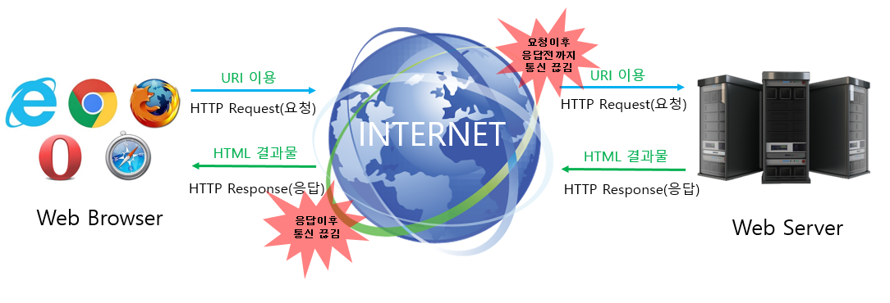

# Polling vs Long Polling vs Socket
#### Reference
- [[10분 테코톡] 🕴핀의 Realtime Web](https://youtu.be/mHMR03kaBHw)

---

## Realtime Web이란?
- 인터넷에서 사용자들로 하여금 창작자가 정보를 만들어내는 즉시 수실할 수 있도록하는 기술 혹은 서비스

그 전에,

---

## 전통적인 웹
- 웹은 HTTP 요청 - 응답 모델을 기반으로 구축됐다.
- HTTP는 무상태 프로토콜이며 클라언트와 서버 간의 통신은 각각의 독립적인 요청과 응답의 쌍으로 구성된다.
- 웹 브라우저에서 폼을 채우고 이를 웹 서버로 제출하는 하나의 요청으로 웹 서버는 요청된 내용에 따라서 데이터를 가공하여 새로운 웹 페이지를 작성하고 응답으로 되돌려준다.

 

- 요청이 있을 때마다 페이지를 그려서 효율적이다.

그래서 등장한

---

## AJAX
- 사용자의 인터페이스 나머지 부분을 방해받지 않고 `비동기`로 데이터를 송/수신 할 수 있다.
- 전체 페이지를 다시 로딩하는 것이 아닌 일부분만 변경하기 때문에 빠른 화면 전환이 가능하다.

AJAX기반, 실시간 웹 기술들을 알아보자.

---

## Polling(폴링)
- 전송할 데이터의 유무에 관계없이 주기적으로 요청을 수행하는 방법이다.
- 클라이언트는 지전된 시간 간격에 맞춰 서버에 지속적인 요청을 보낸다.
- 서버는 각 요청마다 가용 데이터나 데이터가 없는 경우 빈 데이터를 보내거나 실패와 같은 적절한 응답을 한다.

#### 단점
- 데이터의 유뮤에 관계없이 요청하여 불필요한 네트워크 비용이 발생한다.
- 클라이언트와 서버 자원을 많이 낭비한다.
- 요청의 간격이 길면 실시간성이 떨어진다.
- 반대로 간격이 짧으면 많은 자원을 소비한다.
- 서버 이벤트가 일정한 주기로 발생하면 효율적이다.

---
## Long Polling(롱 폴링)
- 서버 이벤트가 발생할 때까지 응답을 미루는 방법이다.
- 폴링과 다르게 클라이언트의 요청에 대해 서버가 전송할 데이터가 있거나 타임아웃될 때까지 연결을 끊지 않고 지속한다.
- 서버로부터 응답을 받는 그 즉시 롱 폴링 요청을 다시 수행한다.

#### 특징
- 폴링과 다르게 불필요한 네트워크 비용이 덜 발생한다.
- 서버 이벤트가 발생하는 즉시 응답을 하기 때문에 실시간성이 높다.
- 반대로 서버 이벤트가 빈번하게 발생하면 폴링보다 더 많은 요청을 수행한다.
---

## Server-snet events(SSE)
- HTTP를 사용하여 서버 푸시를 구현하는 방법니다.
- HTTP 스트리밍 방식이라고도 하며 SSE 사양에 따라 구현한 방법이다.
- 클라이언트가 요청을 보내면 서버는 무기한 연결을 유지하고 준비가 되면 데이터를 보낸다.
- 서버 이벤트가 발생하면 응답을 완료하여 연결을 끊는 게 아니라 응답 스트림에 청크 단위 데이터를 계속 보낸다.

#### 특징
- HTTP를 사용하기 때문에 기존 개발 방식과 다르지 않다.
- HTTP 헤더로 인한 오버헤드가 거의 없다.
- 연결이 유지되기 때문에 실시간성이 매우 높다.
- 연결이 끊기 경우 재접속 처리를 자동으로 해준다.
- 서버에서 클라이언트로 단방향 통신만 가능하다.

---
## Websocket(웹소켓)
- HTTP가 아닌 웹소켓을 사용하여 실시간 양방향 통신을 지원하는 방법이다.
- HTTP를 통해 웹소켓 프로토콜로 전환하는 handshake 과정이 필요하다.
- 이후 웹소켓을 통해 통신이 이루어진다.

#### 특징
- HTTP를 사용하지 않아 전체 메시지 크기가 줄어든다.
- 클라이언트와 서버의 자원을 최소화할 수 있다.
- 양방향으로 빠른 요청과 응답이 가능하다.

---
## 어떤 기술을 선택할 것인가?

#### Polling
- 서버 개발을 할 수 없는 상황
- 외부 API가 서버 푸시를 지원하지 않는 경우

#### ~~Long Polling~~
- 과거의 유물

#### Server-sent events
- 새로운 데이터를 즉시 수신만 해도 될 때.
- 알림, 실시간 댓글 등을 구현해야할 때