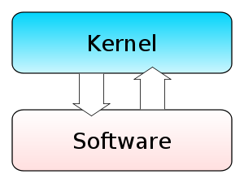
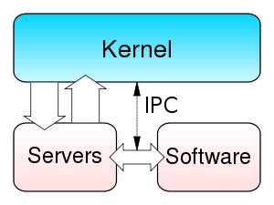
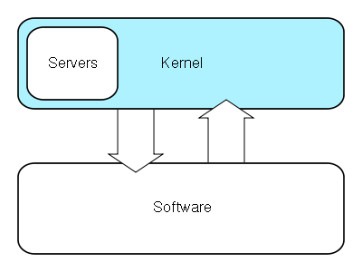
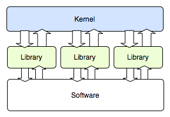

# 커널(Kernel)

> 커널(Kernel)에 대해 알아보자

Reference

-   [[운영체제] Kernal](https://velog.io/@chelsea/%EC%9A%B4%EC%98%81%EC%B2%B4%EC%A0%9C-Kernel)
-   [커널 (컴퓨팅)](https://ko.wikipedia.org/wiki/%EC%BB%A4%EB%84%90_(%EC%BB%B4%ED%93%A8%ED%8C%85))
-   [커널의 의미와 기본 수행동작](https://yjcode.tistory.com/4)

# 커널(Kernel)이란?

-   운영체제(OS)의 심장이자 OS를 규정짓는 매우 중요한 부분이다.
-   하드웨어의 자원을 자원이 필요한 프로세스에 나눠주고, 덩달아 프로세스 제어(태스크 매니저), 메모리 제어, 프로그램이 운영체제에 요구하는 시스템 콜 등을 수행하는 부분으로 운영체제 맨 하부에서 돌아간다.
-   현재 많이 사용되고 있는 OS는 커널 위에 여러 가지 레이어를 올린 것이다.
-   이렇기 때문에 커널이 날아가게 되면 운영체제를 못쓰게 된다.

---

## 커널과 운영체제의 차이

#### 비교 차트

|비교의 근거|커널|운영 체제|
|---|---|---|
|기본|커널은 운영체제의 중요한 부분|운영체제는 시스템 프로그램|
|인터페이스|커널은 소프트웨어와 컴퓨터 하드웨어 간의 인터페이스|운영체제는 컴퓨터의 하드웨어와 사용자 간의 인터페이스|
|유형|획일화 된 커널과 마이크로 커널|다일 및 다중 프로그래밍 일괄 처리 시스템, 분산 운영 체제, 실시간 운영 체제|

운영 체제는 크게 사용자 영역과 커널 영역으로 나누어져 있다.

-   사용자 영역은 실제 사용자가 응용 프로그램 (즉, 어플리케이션)을 이용하기 위해서 마련한 공간이다.
-   커널 영역은 사용자 영역에서 사용자가 이용하는 프로그램이 안전하고 효율적으로 작동하기 위해서 컴퓨터의 자원들을 관리하는 영역이다.

__즉, 커널은 운영 체제의 일부분으로, 운영 체제의 핵심적인 역할을 하는 부분.__  
__운영체제에서 CPU, 메모리, 입출력 장치등과 같은 중요한 자원을 초기화하고 관리하는 부분을 말한다.__

-   컴퓨터와 전원을 켜면 운영체제는 이와 동시에 수행된다.
-   한편 소프트웨어가 컴퓨터 시스템에서 수행되기 위해서는 메모리에 그 프로그램이 올라가 있어야 한다.
-   마찬가지로 운영체제 자체도 소프트웨어로서 전원이 켜짐과 동시에 메모리에 올라가야 한다.
    -   하지만, 운영체제처럼 규모가 큰 프로그램이 모두 메모리에 올라간다면 한정된 메모리 공간의 낭비가 심할것이다.
    -   따라서 운영체제 중항상 필요한 부분만을 전원이 켜짐과 동시에 메모리에 올려놓고 그렇지 않은 부분은 필요할 때 메모리에 올려서 사용하게 된다.
    -   이 때메모리에 상주하는 운영체제의 부분을 **커널**이라 한다.
-   이에 반해 넓은 의미의 운영체제는 커널뿐 아니라 각종 시스템을 위한 유틸리티들을 광범위하게 포함하는 개념이다.

---

## 커널이 하는 일

#### 메모리 관리 (Memory Management)

-   커널은 여러 프로세스들을 동시에 구동을 위해 메모리를 할당하고 관리한다.
-   하지만 메모리의 하드웨어적 자원은 항상 제한되어 있고, 이 제한된 메모리를 여러 프로세스에 동시에 할당하기에는 부족한 경우 커널이 적극 개입하여 메모리를 적절한 시기에 각각의 프로세스에 할당한다.

#### 장치 관리 (Device Management)

-   컴퓨터는 본체 뿐만이 아니라 모니터, 키보드, 마우스와 같은 많은 외부장치가 부착되어 있다.
-   하지만 이들 외부장치는 각각의 고유한 사용방법이 있으며, 이러한 사용방법을 컴퓨터가 모르고, 제공하기 않는다면 외부장치들은 사용할 수가 없게된다.
-   이러한 사용방법을 명시해놓은 표준화된 사용설명서(인터페이스)를 디바이스 드라이버라고 생각하면 좋다.  
    (주의 : 여기서 말하는 사용설명서는 사용자가 아닌 컴퓨터를 위한 설명서이다.)
-   이러한 디바이스 드라이버를 제공하여 주는 것이 커널이고, 커널이 인식하지 못하는 디바이스의 경우는 유저가 직접 해당 디바이스의 드라이버를 설치해서 커널이 디바이스를 인지하고 제어할수 있도록 하여 준다.

#### 프로세스 스케쥴링(Process Scheduling)

-   리눅스는 선점형 멀티태스킹을 기반으로 하고있다.
-   그렇기 때문에 프로세스들이 멀티태스킹을 할 때 커널이 프로세스에 대한 스케줄을 제어하지 않으면 각각의 프로세스에 대한 공정한, 효율적인 CPU 할당이 불가능하다.
-   그렇기에 커널은 메모리에 올라와 있는 프로세스에 대한 CPU사용 우선순위와 같은 스케줄을 관리한다.

#### 프로세스 생성, 종료

-   운영체제가 있는 컴퓨터 환경에서 메모리 관리나 프로세스 스케줄링을 커널이 직접 관장하고 있기 때문에 새로운 프로세스가 실행될 때, 해당 프로세스 입장에서는 메모리의 어느부분에 올라가야 다른 프로세스의 영역을 침범하지 않는지 알 수있는 방법이 없다.
-   마찬가지로 프로세스가 종료될때도 스스로가 종료가 되면 다른 프로세스에게 자신이 종료되었음을 알려줄 방법이 없다.
-   다른 프로세스를 실행할 프로세스가 살펴보고, 마찬가지로 종료 직전 자신이 종료될 것을 다른 프로세스에게 알려주면 되지 않느냐고 생각할 수도 있지만 다른 프로세스들을 살펴볼수 있게 되면 보안에 치명적인 구멍이 생기게 되고, 종료될 것을 다른프로세스에게 종료 직전 알려주고 미처 스스로 종료하기도 전에 다른 프로세스가 아직 종료되지 않은 메모리 영역을 침범하게 되면 비정상 동작을 하는 등의 치명적인 오류가 발생할 수도 있다.
-   그렇기 때문에 이러한 프로세스의 생성과 종료는 커널이 관장하여야 한다. 여기까지만 봐도 커널이 하는 역할은 사용자가 실제로 사용할 프로세스의 관리, 매니징 역할 이라는 것을 알 수 있다.

#### 파일 유틸리티 시스템 제공

-   우리가 흔히 알고있는 파일 탐색기에 해당한다.
-   이것은 특정 프로그램이 관여하는 것이 아니라 커널에서 자체적으로 제공한다.
-   만약 파일 시스템이 커널레벨이 아닌 유저레벨에서 관리된다면, 파일 시스템을 삭제하는 순간 해당 파일 시스템에서 관리하던 파일에 대한 노드정보 소실로 의도하지 않은 파일손상을 불러오거나, 여러 파일시스템을 설치하였을때 서로 간에 동일한 파일구조를 보여줄 수 없는 등의 문제가 발생할 수있다.
-   그렇기 때문에 파일 유틸리티 시스템은 커널에서 직접 관리(ex. 파일 검색, 생성, 삭제, 수정 등의 기능 관리 및 제공)하고 있다.

#### 네트워크

-   보통 네트워크 통신을 구현할 때 프로그래머가 구현하는 부분은 사실상 이 OSI 7계층의 각각 계층에서 무엇을 어떻게 작업하여 어떤 정보를 보내줄지 설계해주는 것이 다이고,
-   물리적인, 혹은 LOW LEVEL에서의 논리적인 기능은 커널이 관장하는 경우가 대부분이다.
-   이러한 구조를 이용하면 프로그래머는 정해진 규칙대로 사용법만 명시하여주고, 커널은 이미 정해진 방법을 기반으로 이를 대신 처리하여 주는 방식으로 통신을 하게 되며, 정형화된 통신이 가능해지므로 더욱 정확하고 간단한 프로그래밍이 가능하게 된다.

#### 시스템 호출 API 제공

-   프로세스 입장에서는 필요한 기능이나, 보안과 같은 문제 때문에 프로세스 자체적으로는 실행 할 수 없는 기능들이 있다. (ex. 디바이스 드라이버, 특정 파일 열람)
-   이러한 것들은 직접적인 접근은 커널에서만 접근을 할 수 있는데, 프로세스가 해당 정보를 필요로 할때는 커널에게 이러한 정보가 필요하니 알려달라고 요청, 혹은 이러한 정보를 적용해야 하니 적용을 해달라고 요청하게 된다.
-   이럴 경우 커널은 해당 정보를 받은 후 권한과 같은 적절성을 검토 후 실행을 하게 된다.
-   여기서 컴퓨터는 사람과 달리 의미가 비슷하면 알아서 이해하는 것이 아니라 정확한 요청 형식이 있어야 한다.
-   이는 컴퓨터가 의미를 통한 의사전달이 아니라 데이터에 의한 의사전달이 이루어지기 때문에 요청 형식에 있어서 조금의 차이만 있어도 다른 의미로 해석을 하기 때문이다.
-   그래서 커널이 제공할 수있는 수행기능에 대한 인터페이스가 있어야 하는데 그것이 API이다.
-   시스템 호출 API가 있음으로 유저레벨 프로세스가 더욱 자세하고 효율적인 기능을 수행할 수 있게 되었다. 

---

## 커널의 종류

#### 추상화란?   
   
같은 종류의 부품에 대해 다양한 하드웨어를 설계할 수 있기 때문에 하드웨어에 직접 접근하는 것은 문제를 매우 복잡하게 만들 수 있다. 일반적으로 커널은 운영 체제의 복잡한 내부를 감추고 깔끔하고 일관성 있는인터페이스를 하드웨어에 제공하기 위해 몇 가지 하드웨어 추상화(같은 종류의 장비에 대한 공통 명령어의 집합)들로 구현된다. 이 하드웨어 추상화는 프로그래머가 여러 장비에서 작동하는 프로그램을 개발하는 것을 돕는다. 하드웨어 추상화 계층(HAL)은 제조사의 장비 규격에 대한 특정한 명령어를 제공하는 소프트웨어 드라이버에 의지한다.

### 단일형 커널(Monolithic Kernel)

-   단일형 커널은 커널의 다양한 서비스 및 높은 수준의 하드웨어 추상화를 하나의 덩어리로 묶어 놓은 구조이다.
-   하드웨어 위에 높은 수준의 가상 계층을 정의 하며, 높은 수준의 가상 계층은 기본 연산 집합, 관리자 모드에 작동하는 모듈인 프로세스 관리, 동시성, 메모리 관리 등의 운영 체제 서비스를 구현 하기 위한 시스템 콜로 이루어진다.
-   이러한 구조이다 보니 연산들을 제공하는 모듈이 분리 되어 있더라도 같은 주소, 메모리 공간 내에서 실행 되기 때문에 코드의 집적도가 매우 조밀하며, 한 모듈의 버그가 시스템 전반을 다운 시킬 수 있다.
-   그러나 구현도가 높고 신뢰성이 높아지면 효과적으로 시스템 이용해서 효율이 높다.

### 마이크로 커널(Micro Kernel)

-   마이크로 커널을 하드웨어 위에 매우 간결한 추상화를 정의한다.
-   기본 연산 집합과 운영 체제 서비스를 구현한 스레드 관리, 주소 공간, 프로세스 간의 통신의 작은 시스템 콜로 이루어져 있다.
-   일반적으로 커널이 제공하는 네트워킹과 같은 다른 서비스들은 사용자 공간 프로그램인 서버로 구현됩니다.
-   운영 체제는 서버를 다른 일반적인 프로그램 처럼 간단히 켜고 끌 수 있으며, 네트워킹 지원이 필요없는 경우 서버를 끄면 된다.
-   일반적으로는 마이크로 커널과 단일형 커널은 정반대의 모습을 지니고 있어 많이 대조된다.

### 혼합형 커널(Hybrid Kernel)

-   혼합형 커널은 본질적으로는 마이크로 커널을 따르고 있으나, 비 본질적인 기능이더라도 사용자 레벨에서 수행 될때 성능 상 느린 코드들을 커널  레벨에서 수행 하도록 수정한 것을 말한다.
-   하이브리드 커널은 다양한 운영 체제 개발자들이 마이크로 커널 기반의 운영 체제 개발을 하다 마이크로 커널의 한계를 느끼고 타협한 결과이다.

### 엑소 커널(Exo Kernel)

-   낮은 수준의 하드웨어 접근을 위한 최소한의 추상화를 제공한다.
-   엑소커널의 기본 아이디어는 개발자에게 가장 낮은 수준의 추상화를 제공 함으로써 개발자들이 하드웨어와 관련해 가능한 많은 결정권을 가지도록 만든 것이다.
-   엑소커널은 보호와 다중화만 제공 하므로 크기가 매우 작고 마이크로 커널의 메시지 전달이나 단일형 커널의 추상 계층에 비해 훨씬 간단하다.
-   엑소커널 에서 구현된 애플리케이션은 라이브러리 운영 체제 라고 불리는데, 이 라이브러리 운영 체제는 특정 메모리 영역, 디스크 블럭등의 자원을 엑소 커널에게 요청 할 수 있다.

---

## 시스템 콜 정리

시스템 콜이란 프로그래밍 언어에서 지원하지 않는 기능에 대하여 운영 체제의 루틴을 호출하여 이용하는 것을 말한다. 

### 시스템 콜의 기능

1.  사용자 모드에 있는 응용 프로그램이 커널의 기능을 사용할 수 있도록 한다.
2.  시스템 호출을 하면 사용자 모드에서 커널 모드로 바뀐다.
3.  커널에서 시스템 호출을 처리하면 커널 모드에서 사용자 모드로 돌아가 작업을 계속한다.

### 시스템 호출의 유형

1.  프로세스 제어(process Control)
2.  파일 조작(file manipulation)
3.  장치 관리(Device Management)
4.  정보 유지(Information maintenance)
5.  통신(Communication)
