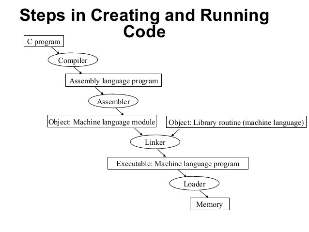
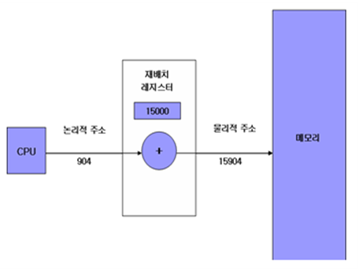
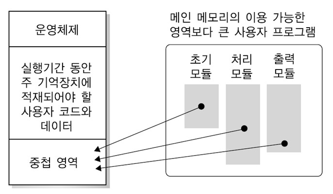
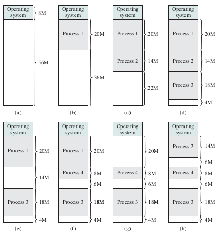
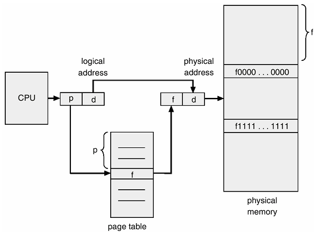
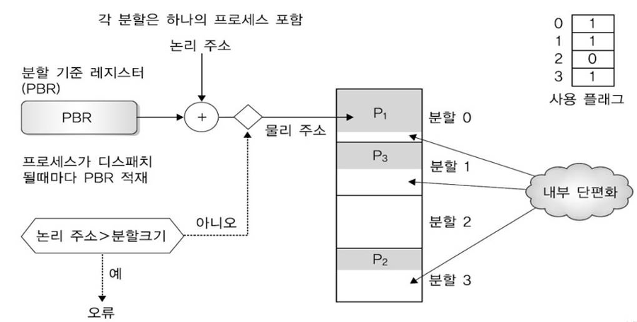

# Process & Thread

> 
>
> 페이지와 세그먼트에 대해서 알아보자.
> 

#### Reference
- [운영체제 - 메모리관리](https://copycode.tistory.com/88?category=740133)
- [운영체제와 정보기술의 원리 - 7.메모리 관리](http://www.yes24.com/Product/Goods/90124877)

---
## 메모리 개요 - 용어 정리

#### 메모리의 기능
- 메모리는 `주소`와 `데이터`로 구성되어 있다. 
- CPU가 원하는 데이터의 주소를 메모리에 보내주게 되면 메모리는 CPU에게 해당하는 데이터를 보내준다. 
- 또한 CPU에서 계산된 결과를 메모리의 특정 주소에 저장하고 명령을 보내면 메모리에 해당 주소에 데이터를 저장한다.

#### 파일의 형태
- 프로그램을 개발할 때는 여러 가지의 파일 형태를 가진다. 
    - `소스 파일`은 고수준언어 또는 어셈블리언어로 개발된 파일을 말한다. 
    - 소스 파일은 컴파일러와 어셈블러에 의해 `목적 파일`로 전환된다. 
    - `목적 파일`은 소스 파일에 대한 컴파일 또는 어셈블 결과를 나타내는 파일로 기계어로 나타내어진다. 
    - 목적 파일을 `링크`가 `실행파일`로 바꾼다. 
    `실행파일`은 `링크` 의 결과로 나타난 파일이다. 

#### 링크와 로더
- `링크`는 하드디스크에 들어가 있는 다양한 내장 함수(Library)들을 실행하기 위해 연결을 해주는 과정이다. 
- 만들어진 실행 파일을 메모리에 __적재__ 하는 과정을 하는 것은 `로더`이다. 
- `실행 파일`은 `로더`에 의해 적재되어야만 실행이 가능하다.

---
## MMU(Memory Management Unit)

- 실행 파일이 만들어지면 로더에 의해 메모리에 올려 진다. 
- 운영체제는 이 실행 파일을 메모리의 어느 부분에 올릴지를 결정한다. 
- 다중 프로그램의 환경에서 메모리에 프로그램을 넣어주고 다시 하드디스크로 보내주고 하는 과정들을 모두 운영체제에서 담당하여 처리를 한다. 
- 사실 `고수준언어`를 작성할 때에는 주소를 사용하여 작성하지 않지만 `목적 파일`로 바뀌어 실행 파일을 사용하면 __주소의 값을 통해 코드를 이동하고 작동을 하게 된다.__
- 따라서 메모리에 적재할 때 적절한 메모리 위치에 프로그램을 넣지 않으면 문제가 발생할 수 있다. 이러한 문제를 해결하는 것이 __MMU__ 이다. 

#### MMU 재배치 레지스터
- MMU는 __주소의 영역__ 을 정해주는 역할을 한다.
- MMU에는 `재배치 레지스터` 가 존재하는데 이는 __코드가 원하는 주소를 만들어주는 역할__ 을 한다. 
    - 예를 들어 코드에서 904번지에 들어가야 하는 프로그램이 작성되어 있는데 메모리에서 빈 공간이 주소가 15000번지 있다고 한다. 
    - 그러면 재배치 레지스터에서 15000이라는 값을 더해주어 코드가 15904번지에서 실행하는 것이 맞게 해주는 것이다.

 

#### 정리
- MMU는 프로그램이 동작할 때 필요한 데이터나 동작들을 메모리의 특정 주소 위치로부터 가지고 와야 하는데 이는 프로그램이 만들어질 때 코드화 되어 있다. 
- 따라서 항상 같은 위치의 메모리 주소로부터 데이터를 불러오게 된다. 
- 하지만 메모리에 프로그램을 적재할 때 항상 같은 위치에 프로그램을 올릴 수는 없다. 
- 메모리 공간에서 빈 공간을 찾아 프로그램을 올리기 때문에 어떨 때는 0번지에 올리기도 하고 다른 날에는 15000번지에 올리기도 한다.
- 그래서 이를 맞추어 조절해주는 역할을 하는 것이 바로 MMU의 재배치 레지스터이다.
    - 재배치 레지스터는 CPU가 프로그램을 실행시킬 때 코드를 읽어 들어가는데 코드에서 특정 위치의 메모리 주소로부터 데이터를 가지고 오라는 동작을 할 때 도움을 준다. 

- CPU가 필요한 부분의 특정 위치를 가르쳐주면 `재배치 레지스터`는 이 주소에서 메모리에 프로그램이 있는 위치 주소를 더하고, CPU에서 원하는 데이터 위치와 메모리상에 프로그램의 위치를 맞게 맞추어 준다.
- 여기서 __CPU에서 MMU로 보내는 주소__ 를 `논리 주소`라고 하고 __MMU에서 메모리로 보내는 주소__ 는 `물리 주소`라고 한다.

---
## 메모리 낭비 방지
#### 동적 적재
- `동적 적재`는 프로그램 실행에 반드시 필요한 루틴/데이터만 적재(프로그램을 메인 메모리에 올리는 동작)하는 것을 의미한다. 
- 우리가 작성한 루틴이 다 사용되는 것이 아니고 모든 데이터가 다 사용되는 것도 아니다. 
- 따라서 프로그램의 모든 동작을 메인 메모리에 다 적재를 하면 차지하는 공간이 많아지게 된다. 
- 동적 적재는 이런 문제를 해결하기 위해 실제 실행되는 반드시 필요한 루틴/데이터만 적재를 하는 것이다. 
- 예시로 오류처리나 사용하지 않는 데이터와 같은 부분은 사용을 할 경우에만 메모리로 적재를 하고 아닐 경우에는 적재시키지 않는다. 
- 이를 통해 메모리의 효율을 높일 수 있다.

#### 동적 연결
- `동적 연결`은 여러 프로그램에 공통 사용되는 라이브러리를 관리하는 방법이다.
- 여러 가지의 프로그램이 메모리상에 존재할 때 공통으로 사용하는 라이브러리가 존재한다..
- 하지만 동적 연결을 하지 않으면 각각의 프로그램에 필요한 라이브러리가 각각 메모리에 적재되게 된다. 
- 공통 라이브러리 루틴을 메모리에 중복으로 올리는 것은 메모리에 낭비가 된다. 
- 라이브러리 루틴 연결을 실행 시까지 미루고 오직 하나의 라이브러리 루틴만 메모리에 적재해서 이 루틴과 연결을 하도록 하는 방법을 해서 적용시키면 낭비되는 메모리를 줄여 효율을 높일 수 있다.

 

#### Swapping
- `Swapping`은 기술은 메모리에 적재되어 있으나 현재 사용되지 않고 있는 프로세스를 관리하는 역할을 한다.
- 메모리 활용도 높이기 위해 현재 사용되지 않는 프로세스를 하드디스크의 일부분인 `Backing store`로 몰아낸다(`swap-out`).
- 이와 반대로 필요한 부분이 생기면 그 부분에 대해 메모리로 적재해서 올려준다.(`swap-in`)
- 메모리의 활용도를 높일 수 있어 효율이 높아지지만, 하지만 프로세스의 크기가 크면 Backing store 입출력에 따른 부담이 크다. 

 

---
## 연속 메모리 할당

- 컴퓨터의 구조가 발달되어 오면서 운영체제는 다중 프로그래밍 환경을 조성하게 된다. 
- 부팅 직후 메모리에 운영체제가 하드디스크로부터 적재되고 컴퓨터가 동작을 하는 것을 기다린다. 
- 그 후 여러 가지의 프로그램이 동시에 올라와서 스케줄링에 의해 CPU나 I/O를 할당받는다.

#### Scatterd Holes
- 부팅 직후에는 운영체제만 적재되어 있으므로 운영체제를 제외한 공간이 모두 비어 있고, 이 비어있는 공간을 `big single hole`이라고 한다.
- 이후 프로세스가 생성되고 종료되는 작업을 반복하며 컴퓨터가 동작하게 된다. 
- 프로세스들은 여러 위치의 메모리에 적재되기 때문에 `scattered holes`가 생성되게 된다. 
    - 프로세스가 순서대로 쌓이더라도 작업이 끝나는 순서는 정해져 있지 않고 다시 들어오는 프로세스와도 메모리 공간 차지 사이즈가 다르기 때문에 메모리의 빈 공간이 중간 중간에 계속 생성된다.

 

#### 외부 단편화
- scattered holes가 계속 발생하게 되면 hole 들이 불연속하게 흩어져 있게 되어 `메모리 단편화 현상`이 발생하게 된다. 
- 이처럼 메모리의 빈 공간은 많은데 사이즈가 작은 빈 공간이 많아 다른 프로세스를 적재할 수 없는 현상을 `외부 단편화`라고 한다. 
- 다시 말하면, hole들의 크기를 모두 합치면 프로세스를 충분히 적재할 수 있는데 떨어져 있어서 프로세스가 못 들어가는 현상이다. 

#### 연속 메모리 할당 방식
외부 단편화를 없애는 방식으로 `연속 메모리 할당 `방식을 사용한다. 
연속 메모리 할당 방식에도 3가지의 방법이 존재한다.

- __최초 적합(First-fit)__ : 메모리를 순차적으로 탐색하여 제일 먼저 발견한 적절하게 들어갈 수 있는 곳을 찾아 프로세스를 적재하는 방법이다.
- __최적 적합(Best-fit)__ : 메모리를 탐색하여 메모리 공간 중에서 제일 적절하게 들어갈 수 있는 곳을 찾아 프로세스를 적재하는 방법이다.
- __최악 적합(Worst-fit)__ : 메모리에 넣는데 크기와 제일 안 맞는 공간(프로세스보다 큰 메모리 공간 중에서)에 프로세스를 넣는 방식이다.

#### 연속 메모리 할당 방식의 선택
 - __속도 측면__ : 최초 적합(First-fit)
    - 최초 적합은 메모리를 순서대로 탐색하여 가장 먼저 발견되는 공간에 적재하기 때문에 속도 면에서는 가장 빠르다고 할 수 있다. 
- __이용률 측면__ : 최적 적합(Best-fit)
    - 속도는 조금 떨어지지만 정확하게 맞는 위치에 들어가는 방식을 취하기 때문에 애매한 빈 공간을 창출할 일이 많이 없다. 
    - 최초 적합의 경우는 자신의 프로세스 크기보다 메모리 공간이 더 큰 경우가 발생하면 무조건 프로세스를 넣지만 최적 적합은 빈 공간을 제일 안 만드는 측면으로 프로세스를 적재한다. 
    
하지만 대부분의 경우를 비교해보면 최초 적합과 최적 적합의 이용률의 차이가 많이 발생하지는 않는다.

연속 메모리 할당의 방식을 사용하더라도 외부 단편화로 인한 메모리 낭비가 1/3 정도 발생한다. 
이런 방식을 해결하는 또 다른 방법이 `Compaction`이다. 

#### Compaction
- Compaction : hole 들을 한 곳으로 모으겠다는 방식.

- 문제점 :  
    - hole들을 한 곳으로 모으기 위해서는 메모리를 움직여야한다. 
    - 그래서 메모리 계산에 대한 부담이 크다. 
    - 또한 hole을 어디로 움직이는 게 좋은가에 대한 문제가 발생한다. 
    - 이렇기 때문에 hole을 움직이거나 프로세스를 움직이는 Compaction 방식의 최적의 알고리즘은 존재하지 않는다. 

그렇다면 이런 메모리 낭비를 어떻게 해결을 한 것일까?

---
## Paging
- Paging : 프로세스를 일정 크기인 페이지로 잘라서 메모리에 적재하는 방식이다. 
- 프로세스는 항상 연속해서 들어가야 한다는 생각을 통해 메모리 공간 활용에 있어서 앞장에서는 연속 메모리 할당에 초점을 맞추었다. 
- 이런 생각부터 뒤집어서 프로세스를 일정한 단위로 잘라서 사용하자는 방식이 페이징이다. 
- hole과 프로세스를 모두 특정 페이지 단위로 잘라서 메모리 공간을 관리한다. 

하지만 프로세스를 자르게 되면 실행이 될까? 에 대한 궁금증이 생긴다.
그러면 프로세스를 자르게 되더라도 실행을 할 수 있게 하는 방식은 무엇이 있을까?

#### Page 내부의 재배치 레지스터
- 메모리 공간을 할당할 때 코드에서 명명한 메모리 주소 위치와 다르게 임의로 프로세스를 메모리에 적재했다.  
    - 이렇게 할 수 있었던 이유는 바로 MMU의 재배치 레지스터의 값을 바꾸어 CPU를 속일 수 있었기 때문이다. 
- 마찬가지로 프로세스를 나눈 페이지마다 재배치 레지스터를 만들어 놓으면 CPU는 마치 프로세스가 연속된 메모리 공간에서 동작하고 있다고 생각하게 될 것이다. 
- 메모리 공간 할당 방식과 동일하게, 재배치 레지스터에서 메모리 적재 공간의 값을 더해주어 CPU를 속이기 때문이다.

#### Page Table
- 프로세스를 자르는 단위는 `Page`이다. 
- 이와 동일한 크기로 메모리를 자른 것을 `Frame`이라고 한다. 

- 같은 크기로 페이지와 프레임으로 잘라져 있기 때문에 페이지를 프레임에 할당하면 딱 맞아 떨어진다. 
- 이 때 페이지를 관리하는 MMU는 `페이지 테이블`이 된다. 
- `페이지 테이블 안에 있는 개수`는 __프로세스를 몇 등분하는가__ 에 따라 결정된다.

#### Paging방식의 동작
- 정리
    - CPU가 내는 주소는 논리 주소(Logical address)라고 한다. 
    - CPU에서 보낸 논리 주소는 MMU인 페이지 테이블을 통해 물리 주소(Physical address)로 바뀌어서 메모리에서 찾게 된다. 
    - 논리 주소는 2진수로 표현된 m개의 비트이다. 
    - 하위 n비트는 오프셋 또는 변위를 나타내고 상위의 m-n비트는 페이지 번호를 나타낸다. 
    - n비트는 페이지를 어떤 크기로 나누는 정도에 따라 다르게 된다. 
    - 예를 들어 16바이트로 페이지를 나눈다고 생각하면 n은 4비트가 된다(2진수로 표현된 값이기 때문, 2^`4` = 16).

- 동작
    - 페이지 테이블에서 페이지 번호를 가져와서 해당하는 프레임 번호를 가져온다. 
    - 페이지 번호는 페이지 테이블의 인덱스 값으로 인식한다.
    - 페이지 번호에 해당하는 페이지 테이블의 값과 n비트의 값을 가진 물리 주소로 바뀌게 된다.

- 예시
    - 페이지 사이즈 : 4byte
    - page table :{0:5, 1:6, 2:1, 3:2}
    - CPU가 논리 주소로 13번지를 요구할 때, 메인 메모리에서 참조 해야할 물리 주소의 위치는?
        - 13 = 1101(2)
        - 페이지 사이즈 4byte = 2^`2`
        - 여기서 `2`는 하위 2비트를 의미하고 물리주소를 의미한다.
        - 나머지 상위 비트는 `페이지 번호`가 된다.
        - 상위 비트가 2비트 이므로, 11(2) = 3이므로, 페이지 주소의 3번 인덱스에 해당한다.
        - 3번인덱스가 2 = 10(2)이므로, 실제 물리메모리에서 참조해야할 주소는 10+01으로 1001 = `9`번지에 실제 프로세스의 페이지가 위치한다. 

#### 내부단편화

- 하지만 페이징 과정을 진행하면 내부 단편화가 발생할 수 있다. 
- 페이징은 프로세스를 특정 단위인 페이지 단위로 나누어 주고 된다. 
- 하지만 프로세스의 크기가 페이지 크기의 배수가 아니라면 마지막 프로세스의 페이지는 한 프레임을 다 채울 수 없다. 
- 따라서 이런 공간이 메모리 안에서 빈 공간으로 남아 낭비되게 된다. 
- 이런 문제를 `내부 단편화`라고 한다. 
- 하지만 외부 단편화에 비해 낭비되는 내부 단편화의 메모리 공간이 매우 작긴하다.

---
## Segmentation
- Segmentation : 프로세스를 물리적인 단위인 page가 아닌 논리적 내용 단위인 `Segment`로 자르는 방식
- 세그멘테이션은 프로세스를 세그먼트의 집합으로 생각한다.
- 논리 단위로 프로세스를 자르는 이유
    - 하나의 프로세스가 동작하려면 기본적으로 코드, 데이터, 스택 세 가지의 세그먼트는 항상 가지고 있다.
    -  코드에서도 main 함수가 있을 수 있고, 다른 함수들이 있을 수도 있고, 다른 루틴이 있을 수도 있다. 
    - 데이터를 보아도 어떤 구조체가 있을 수도 있고 배열도 있을 수 있다. 
    - 이러한 이유로 세그먼테이션은 물리적인 크기의 단위가 아닌 논리적 내용의 단위(의미가 같은)로 자르기 때문에 세그먼트들의 크기는 일반적으로 같지 않다.

#### 메모리에 할당
- 메모리에 할당하는 방법은 MMU 내의 재배치 레지스터를 이용하여 논리 주소를 물리 주소로 바꾸어 주는 방식으로, Paging과 같다.
- 다만, 페이지 테이블이 아니라 MMU는 세그먼트 테이블로 CPU에서 할당한 논리 주소에 해당하는 물리 주소의 위치를 가지고 있다. 

#### 주소 변환
- Paging 방식과 대부분 같다.
- 다른점
    - 논리 주소에서 보내는 주소 값에서 하위 변위 비트를 제외한 앞의 비트들은 페이징 번호가 아니라 세그먼트 번호가 된다.
    - 세그먼트 번호를 토대로 테이블 내용으로 들어가 시작 위치 및 한계 값을 파악한다.
    - 물리 주소는 세그먼트 테이블에 있는 시작 위치와 변위 값을 합하여 구할 수 있다. 그런데 이런 주소 값이 한계(각 세그먼트의 크기)를 넘어서면 segment violation 예외 상황 처리를 하게 된다. 이런 경우는 변위가 한계보다 크면 발생한다.

#### 단점
- 세그먼트는 크기가 고정되어 있지 않고 가변적이다.
- 크기가 다른 각 세그먼트를 메모리에 두려면 동적 메모리 할당을 해야하기 때문에 앞에서 말한 외부 단편화가 발생할 수 있다. 

#### 해결방법
- 세그먼테이션과 페이징의 기법을 모두 사용한다. 
- 즉, 세그먼트를 페이징 하는 방법을 취한다.

#### 방식
1. 프로세스를 처음에 세그먼트 단위로 자른다. 
    - 의미 있는 단위로 나누게 되면 보호와 공유를 하는 측면에 이점을 가질 수 있게 된다. 
    - 하지만 앞서 말했듯 외부 단편화가 발생할 수 있다. 
2. 잘라진 세그먼트를 다시 일정 간격인 페이지 단위로 자른다.
    - 이렇게 메모리에 적재하면 페이징의 일정 단위로 다시 잘렸기 때문에 외부 단편화가 발생하지 않는다. 
- 하지만 이와 같은 경우에는 테이블을 두 가지를 모두 거쳐야 하므로 속도 면에서 조금 떨어질 수 있다.

