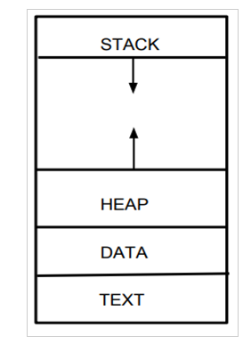
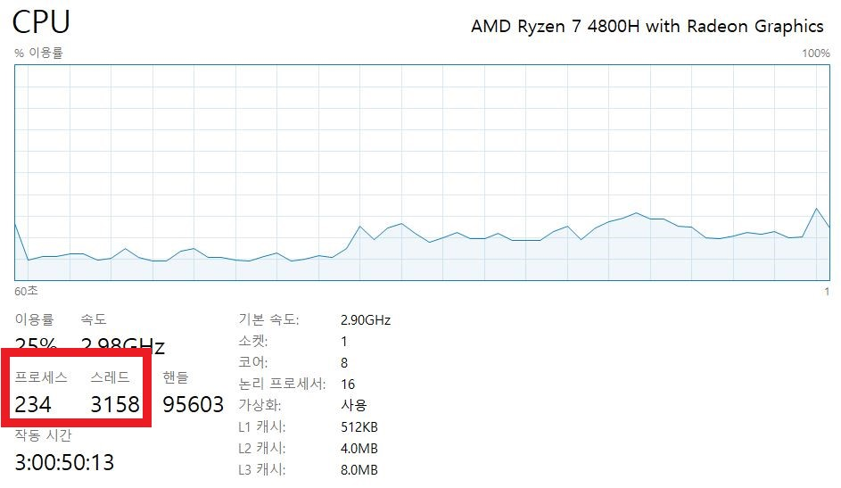
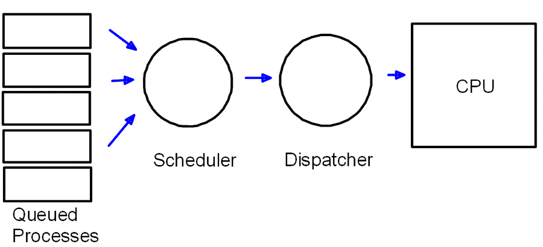
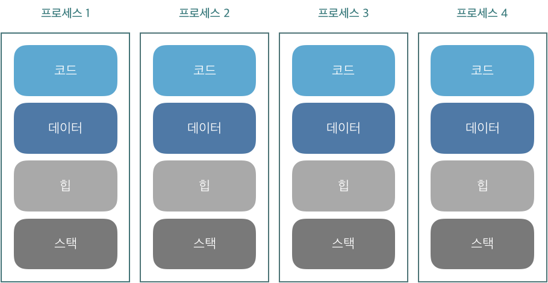
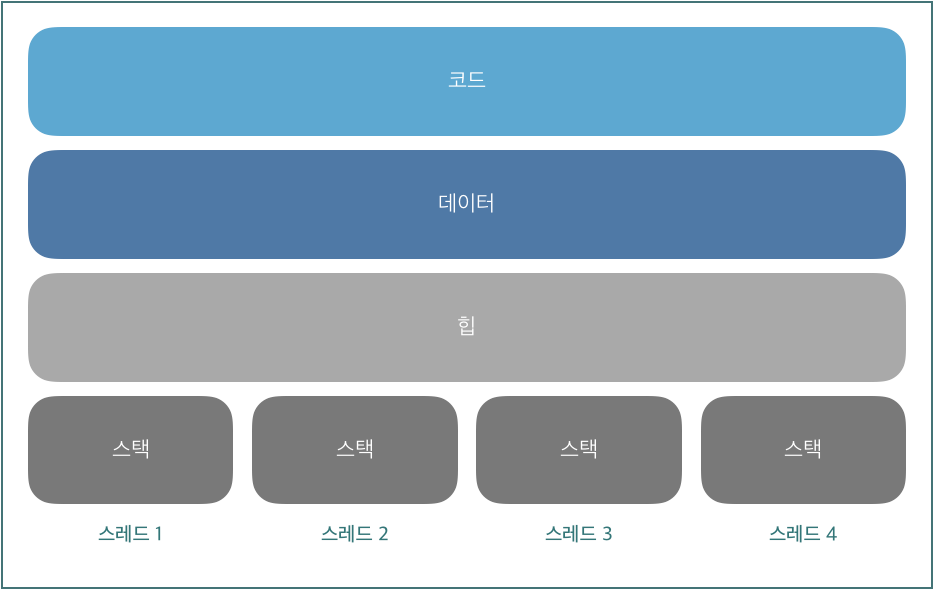
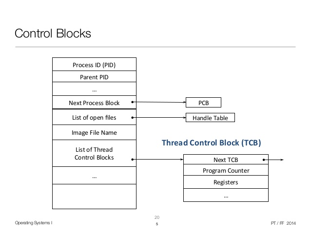
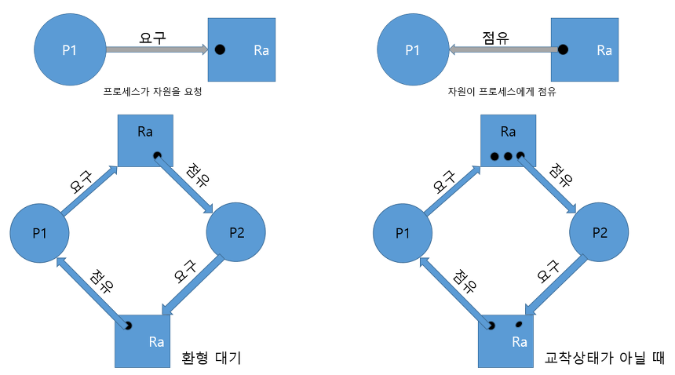

# Process & Thread

> 
>
> 프로세스와 스레드에 대해서 알아보자.
> 

#### Reference
- [[OS] 프로세스와 스레드의 차이](https://gmlwjd9405.github.io/2018/09/14/process-vs-thread.html)
- [프로세스와 스레드의 차이](https://velog.io/@raejoonee/%ED%94%84%EB%A1%9C%EC%84%B8%EC%8A%A4%EC%99%80-%EC%8A%A4%EB%A0%88%EB%93%9C%EC%9D%98-%EC%B0%A8%EC%9D%B4)
- [PCB(Process Control Block)란?](https://jwprogramming.tistory.com/16)
- [[운영체제]프로세스](https://woovictory.github.io/2018/12/25/OS-Process/)

---
## Process

- __Program__ : 
    - 어떤 작업을 위해 운영체제 위에서` 실행할 수 있는 파일`
    - 실행되기 전 상태의 명령어. 코드 및 정적인 데이터의 묶음.
    - 웹 브라우저, 워드 프로세서, 카카오톡 등
- __Process__ :
    - 운영 체제 위에서 `실행중인` 프로그램
    - 운영체제로부터 시스템 자원을 할당 받는 작업의 단위
- __Processor__ :
    - 프로세스가 `동작`될 수 있도록 하는 하드웨어(=CPU)
    - 동작 : 프로그램의 자원들이 메모리에 올라오고, 실행되어야 할 코드의 메모리 주소를 CPU의 레지스터로 올리는 것.

__프로세스는 사용하고 있는 메모리 영역이 존재한다.__

---
## 프로세스 구조
#### Stack : 
- 호출된 함수, 지역변수 등 임시 데이터를 저장.
#### Heap : 
- Java의 new를 통한 동적 할당을 위해 존재하는 공간
#### Data : 
- 전역 변수나 static 변수의 할당을 위해 존재하는 공간
#### Code(=Text) : 
- 프로그램의 코드

 

---
## 멀티태스킹

 

- CPU(프로세서)는 한 순간에 하나의 프로세스만 실행할 수 있다.
- 운영체제가 짧은 시간에 수십번에서 수천번 실행할 프로세스를 교체하고 있기 때문에 우리는 동시에 여러 개의 작업이 실행되고 있다고 느낀다.

---
## 프로세스 문맥(Process contexts)
- __프로세스를 구성하는 모든 요소__

#### 정확하게 프로세스의 문맥이란?

1. CPU 수행 상태를 나타내는 하드웨어 문맥. Program Counter 등의 register들 값을 포함한다.
    - PC는 다음에 수행할 명령어의 위치에 대한 정보(주소값)을 담고 있다.
    - CPU가 할당되었을 때, PC가 가리키는 부분부터 수행해나가면 되는 것이다.
    - 즉, 프로세스가 실행될 부분이라고 생각할 수 있다.
2. 프로세스의 주소 공간을 포함한다.
    - 즉, code, data, stack 각각의 공간에 어떠한 값이 들어있는가를 나타내는 주소값을 포함한다.
    - 현재 변수의 값을 얼마인가? 메모리에는 어떤 내용들이 담겨져 있는가? 스택에는 어느 내용까지 쌓여있는가? 등에 대한 정보를 모두 담고 있다.
3. 프로세스 관련 커널 자료구조를 포함한다.
    - PCB(Process Control Block), Kernel Stack 등을 포함한다.
    - 프로세스가 하나 시작될 때마다 운영체제에서는 그 프로세스를 관리하기 위해 PCB를 생성한다.
    - 커널의 주소 공간에서 data에 해당하는 부분에 PCB를 저장해둔다.
    - 이는 운영체제가 이 프로세스를 어떻게 관리하는지, 어떻게 다루고 있는지 파악할 때 사용된다.
    - 시스템 콜이 발생할 때, 어떤 프로세스가 시스템 콜을 했는지 알기 위해 커널 주소 공간의 Stack에는 시스템 콜을 한 프로세스의 커널 스택 값을 저장하고 있다.

#### 운영체제가 문맥(context)을 알고 있어야 하는 이유

- 현재의 컴퓨터는 time sharing, multitasking 체제이다. 
- 즉, 하나의 CPU가 여러 개의 프로세스를 동시에 수행한다. 
- 짧은 속도로 여러 개의 프로세스를 수행해야 하는 CPU의 입장에서는 이전에 수행하고 있던 프로세스가 어디까지 진행되었는지를 알아야 할 필요가 생긴다.(그래야 효율적이다.) 
- 그 어디까지 진행되었는지에 대한 값을 문맥 즉, context에 저장하고 있기 때문에 이 문맥을 CPU가 알고 있어야 한다.

---
## PCB(Process Control Block)

#### PCB의 구조, 프로세스를 제어하기 위한 정보 모음
1. __프로세스 식별자(Process ID)__
2. __프로세스 상태(Process State)__ : 생성(create), 준비(ready), 실행 (running), 대기(waiting), 완료(terminated) 상태.
3. __프로그램 계수기(Program Counter)__ : 프로세스가 다음에 실행할 명령어의 주소
4. __CPU 레지스터 및 일반 레지스터__
5. __CPU 스케줄링 정보__ : 우선 순위, 최종 실행시각, CPU 점유시간 등
6. __메모리 관리 정보__ : 해당 프로세스의 주소 공간 등
7. __프로세스 계정 정보__ : 페이지 테이블, 스케줄링 큐 포인터, 소유자, 부모 등
8. __입출력 상태 정보__ : 프로세스에 할당된 입출력장치 목록, 열린 파일 목록 등
9. __포인터__ : 부모프로세스에 대한 포인터, 자식 프로세스에 대한 포인터, 프로세스가 위치한 메모리 주소에 대한 포인터, 할당된 자원에 대한 포인터 정보 등.

 

---
## 프로세스의 상태
- __생성(New)__ : 프로세스가 생성 중
    - 프로세스가 생성되었지만 실행가능한 프로세스 집합에 소속되지 못한 상태(프로그램이 메모리에 적재되지 않은 상태)
- __준비(Ready)__ : 프로세스가 설정되어 대기중
    - CPU를 할당받기 위해 준비중인 상태(즉 Queue에서 대기하고 있는 상태를 의미한다. 이는 물리적인 메모리에 적재된 상태를 말한다.)
- __실행(Running)__ : 프로세스가 실행하는 중
    - 프로세스가 CPU를 할당받아 기계어 명령어를 수행중인 상태
- __대기(Block, wait, sleep)__ : 프로세스가 어떤 사건이 발생하기를 기다리고 있는 상태
    - 당장 CPU를 할당해줘도 명령 수행할 수 없는 상태를 말한다. 
    - 디스크에서 file을 읽어와야 하는 오래 걸리는 작업을 하고 있거나 다른 프로세스의 진행을 위해 일부러 재워둔 경우에 해당한다.
- __종료(Exit)__ : 프로세스가 실행 종료
    - 프로세스가 실행 종료된 상태(프로그램이 메모리에서 해제된 상태) 프로세스가 종료되면 정리하는 작업을 진행하게 되는데 이 상태에 해당한다.

---
## 프로세스 상태 전이
프로세스는 아래와 같은 상태 전이를 가진다.

 

- __new -> ready__ : new 상태에서 프로세스가 생성되면 OS 커널에 존재하는 Ready Queue에 올라가게 된다.
- __ready -> running__ : Ready Queue에 있는 프로세스들을 OS가 프로세스 스케쥴링 알고리즘에 의해서 Running 상태로 가야할 프로세스에게 CPU를 할당한다. 그러면 프로세스가 Running 상태가 된다.
- __running -> ready__ : 현재 running 상태에 있는 프로세스 A보다 Ready Queue에서 대기하고 있는 프로세스 B가 우선순위가 높으면, preemptive schedule(선점형)인 경우 프로세스 A는 Ready 상태로 오게 되고 프로세스 B가 Running 상태가 되어 CPU를 할당 받게 된다.
- __running -> blocked__ : 현재 running 상태에 있는 프로세스 A에게 입출력(I/O) 이벤트가 발생했을 때 프로세스 A가 blocked 상태로 가게 된다.
- __running -> exit(terminate)__ : 프로세스 종료.

 

- 디스패치(Dispatch) : 준비 -> 실행
- 타임 아웃(Time out) : 실행 -> 준비
- 대기(block) 또는 사건 준비(Event Wait) : 실행 -> 대기(blocked)
    - I./O 입출력 발생(프로세스가 CPU를 사용 중에 I/O 행위가 필요하여 대기 상태로 이동하는 시점)
- 깨움(wake up) 또는 사건 발생(Event Occurs) : 대기(blocked) -> 준비
    - I/O 요청이 완료되면 다시 ready 상태로 전이

---
## Context Switching

#### 배경
- 프로세스가 생성되면 프로세스 제어 블록(PCB)가 생성되고 프로세스가 종료되면 PCB가 삭제된다.
- 이 PCB를 이용하여 프로세스가 실행됬다가 다시 queue에 들어갔을 때 정보를 저장했다가를 반복하고, 이러한 과정을 Context Switching이라 한다.

#### 설명
- Context Switching (문맥 교환)이란 CPU를 어떤 프로세스에서 다른 프로세스로 넘겨주는 과정을 말한다. 
- System call이나 interrupt가 발생했다고 해서 반드시 Context Switch가 발생하는 것은 아니다.
- 프로세스 내부에서 System call을 요청하거나 interrupt가 외부에서 들어왔어도 운영체제에서의 일을 마치면 다시 할당되었던 CPU로 넘어가게 된다.
- 다른 프로세스로 넘어가는 과정은 상당한 오버헤드를 발생시킨다.
    - cache memory에 있던 진행하던 프로세스에 대한 cache를 모두 비워줘야 하기 때문이다. 그래서 문맥 교환이 일어나는 상황은 크게 두 가지 경우이다.

1. Interrupt 중에서도 timer interrupt가 들어온 경우
2. I/O 요청 System Call이 들어온 경우

- 전환하는 동안 어떠한 유용한 작업도 불가능 하다.

---
## 멀티 프로세스와 멀티 스레드
- 단일 코어 CPU에서 여러 개의 실행 흐름이 동시에 필요하다고 가정하면, 실행 흐름사이에서 데이터를 공유해야 한다. 
- 실행 흐름은 결국 CPU를 점유하고 명령을 실행하는 것을 말하므로 여러 실행 흐름을 구현하려면 멀티프로세스나 멀티스레드로 구현해야 한다.

#### 멀티 프로세스
- 멀티프로세스로 구현한다고 가정하면, 프로세스는 서로 독립적인 메모리 공간을 가지므로 기본적으로 데이터를 공유할 수 없다. 
- 멀티프로세스에서는 모든 프로세스가 서로 다른 메로리 공간을 가지므로 데이터를 공유하려면 특별한 기법을 사용해야 한다.
    - [IPC(Inter Process Communication)](https://jwprogramming.tistory.com/54)

 

#### 멀티 스레드
- 멀티스레드로 구현하면 데이터를 쉽게 공유할 수 있다. 
- 멀티프로세스와 달리 여러 스레드가 스택만 서로 다른 공간을 갖고, 코드, 데이터, 힙은 공유하기 때문이다.

 

---
## Thread
멀티스레드를 먼저 살펴보았는데, 스레드를 정리해보자.

- 스레드(thread)란 프로세스 안의 실행 흐름의 단위로 스케줄러에 의해 CPU를 할당받을 수 있는 명령의 나열이다. 
    - 프로세스는 하나 이상의 스레드로 구성된다.
    - 프로세스가 PCB를 갖는 것처럼 스레드는 스레드 제어 블록(Thread Control Bock, TCB)을 갖는다.   
    - TCB에는 스레드 ID, 각종 레지스터 정보, 스레드 상태 정보, 스레드가 속해 있는 프로세스의 TCB 주소 등이 저장되어 있다.

 https://www.slideshare.net/PeterTrger/07-threads
 

- 프로세스와 스레드 모두 인스트럭션의 나열이고 유사한 정보가 든 메모리 블록을 갖는다. 
- 프로세스가 단일 스레드로 작동하면 프로세스와 스레드는 차이가 없다. 
- 프로세스와 스레드의 차이점을 알려면 멀티프로세스와 멀티스레드를 비교해야 한다.

---
## 다시 멀티 프로세스와 멀티 스레드

#### 멀티 프로세스
- 장점
    - 여러 개의 자식 프로세스 중 하나에 문제가 발생하면 그 자식 프로세스만 죽는 것 이상으로 다른 영향이 확산되지 않는다.
- 단점
    - Context Switching에서의 오버헤드
        - Context Switching 과정에서 캐쉬 메모리 초기화 등 무거운 작업이 진행되고 많은 시간이 소모되는 등의 오버헤드가 발생하게 된다.
        - 프로세스는 각각의 독립된 메모리 영역을 할당받았기 때문에 프로세스 사이에서 공유하는 메모리가 없어, Context Switching가 발생하면 캐쉬에 있는 모든 데이터를 모두 리셋하고 다시 캐쉬 정보를 불러와야 한다.
    - 프로세스 사이의 어렵고 복잡한 통신 기법(IPC)
        - 프로세스는 각각의 독립된 메모리 영역을 할당받았기 때문에 하나의 프로그램에 속하는 프로세스들 사이의 변수를 공유할 수 없다.

#### 멀티 스레드
- 장점
    - 시스템 자원 소모 감소 (자원의 효율성 증대)
        - 프로세스를 생성하여 자원을 할당하는 시스템 콜이 줄어들어 자원을 효율적으로 관리할 수 있다.
    - 시스템 처리량 증가 (처리 비용 감소)
        - 스레드 간 데이터를 주고 받는 것이 간단해지고 시스템 자원 소모가 줄어들게 된다.
    - 스레드 사이의 작업량이 작아 Context Switching이 빠르다.
    - 간단한 통신 방법으로 인한 프로그램 응답 시간 단축
        - 스레드는 프로세스 내의 Stack 영역을 제외한 모든 메모리를 공유하기 때문에 통신의 부담이 적다.
- 단점
    - 주의 깊은 설계가 필요하다.
    - 디버깅이 까다롭다.
    - 단일 프로세스 시스템의 경우 효과를 기대하기 어렵다.
    - 다른 프로세스에서 스레드를 제어할 수 없다. (즉, 프로세스 밖에서 스레드 각각을 제어할 수 없다.)
    - 멀티 스레드의 경우 __자원 공유__ 의 문제가 발생한다. (__동기화 문제__)
    - 하나의 스레드에 문제가 발생하면 전체 프로세스가 영향을 받는다.

---
## Synchronization(동기화)

- 프로세스 동기화: 
    - 프로세스/쓰레드는 같은 데이터에 접근해야 하는 경우가 있다. 
    - 이때 일정한 규칙없이 데이터의 수정을 허용한다면 데이터의 신뢰성을 보장하지 못한다. 
    - 이때 데이터의 일관성을 유지하는 방법을 프로세스 동기화라고 한다.

- 임계구역 : 다른 프로세스(쓰레드)와 공유하는 데이터에 접근하는 구역.
    - 하나의 프로세스가 임계구역에 있을 때에는 다른 프로세스가 임계구역에 접근할 수 없어야 한다.
- 임계구역문제 : 임계구역에 접근하는 프로세스들이 문제없이 데이터를 공유하도록 동기화를 진행하는 방법

임계구역문제를 해결 조건(3가지 조건이 만족되어야 임계구역이 해결된다.)
- 상호 배제(Mutual Exclusion): 
    - 한 프로세스가 임계구역에서 실행되면 다른 프로세스는 그들의 임계구역을 실행할 수 없다.
- 진행(Progress): 
    - 유한한 시간 내에 임계구역에 들어갈 프로세스를 정해야한다.
- 한정된 대기(Bounded Waiting): 프로세스가 임계구역을 들어가기 위한 요청 이후 실제 진입까지의 과정이 유한한 시간내에 일어나야한다. (무한 대기가 일어나서는 안된다.)
- 임계구역 문제를 해결하는 방법으로 피터슨의 방법, Mutext Lock, 세마포, 모니터 등이 있다.

---
## 교착상태와 기아상태
#### Deadlock(교착상태)
교착상태란 무한 대기 상태를 뜻하며 두 개 이상의 작업이 서로 상대방의 작업이 끝나기 만을 기다리고 있기 때문에 다음 단계로 진행하지 못하는 상태를 말한다.

- 교착상태 발생조건
다음 네 가지 조건이 모두 성립할 때 교착상태 발생 가능성이 있다.

 

1. 상호배제(Mutual exclusion) : 프로세스들이 필요로 하는 자원에 대해 배타적인 통제권을 요구한다.
2. 점유대기(Hold and wait) : 프로세스가 할당된 자원을 가진 상태에서 다른 자원을 기다린다.
3. 비선점(No preemption) : 프로세스가 어떤 자원의 사용을 끝낼 때까지 그 자원을 뺏을 수 없다.
4. 순환대기(Circular wait) : 각 프로세스는 순환적으로 다음 프로세스가 요구하는 자원을 가지고 있다.

따라서 위의 한 조건이라도 성립하지 않으면 교착상태가 일어나지 않도록 할 수 있다.

#### 교착상태 해결 방안
교착상태 해결 방법에는 예방, 회피, 회복, 무시의 4가지가 있다.

1. 예방(Prevention)
    - 착상태 발생 조건은 위의 네 가지 경우를 모두 만족시켰어야 했다. 교착상태를 해결하기 위해서는 네 가지 조건 중 하나만 해결을 하면 된다. 
2. 회피(Avoidance)
    - 교착상태의 발생조건을 없애기보다는 발생하지 않도록 알고리즘을 적용하는 방법으로, 자원할당 그래프 알고리즘과 은행원 알고리즘이 있다.
3. 회복(Recovery)
    - 교착상태가 발생하는 것을 아예 막지 않고, 만약 교착상태가 발생하면 발생 이후에 문제를 해결하는 방법
4. 무시(Ignore)
    - 교착상태를 해결할때에도 문맥교환에 의한 오버헤드로 성능 저하가 생긴다. 교착상태에 의한 성능 저하보다 이를 해결할 때의 성능저하가 큰 경우 그냥 무시한다.

#### Starvation(기아상태)
특정 프로세스의 우선순위가 낮아서 원하는 자원을 계속 할당 받지 못하는 상태를 말한다.

#### Deadlock vs Starvation
- 교착상태 : 여러 프로세스가 동일 자원 점유를 요청할 때 발생
- 기아상태 : 여러 프로세스가 부족한 자원을 점유하기 위해 경쟁할 때 발생

#### 기아상태 해결 방안
기아상태는 주로 다음과 같은 방법으로 해결한다.
1. 프로세스 우선순위 수시 변경을 통해 각 프로세스 높은 우선순위를 가지도록 기회 부여
2. 오래 기다린 프로세스의 우선순위 높이기
3. 우선순위가 아닌 요청 순서대로 처리하는 요청큐 사용
